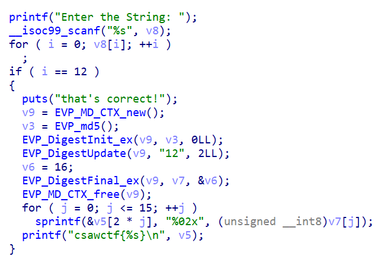
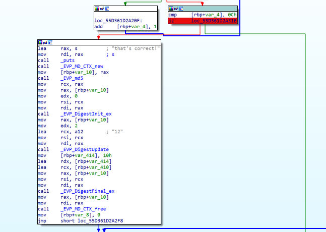
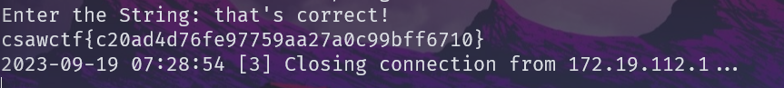
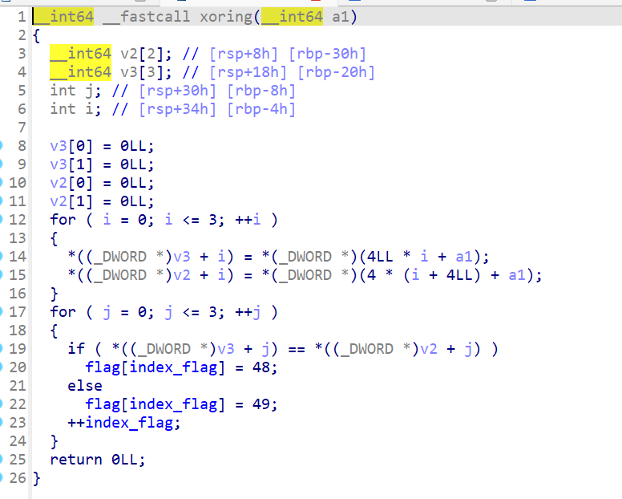
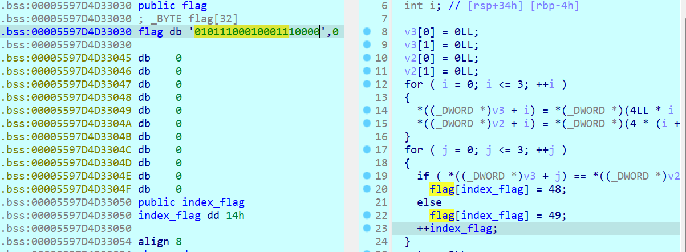
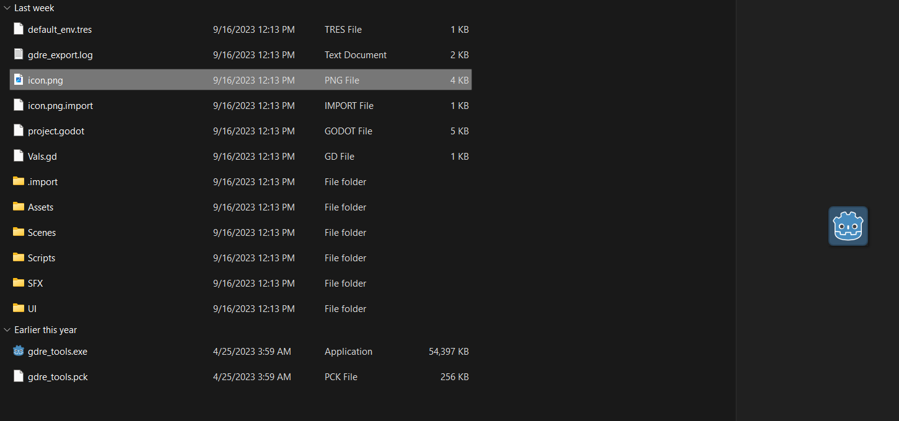
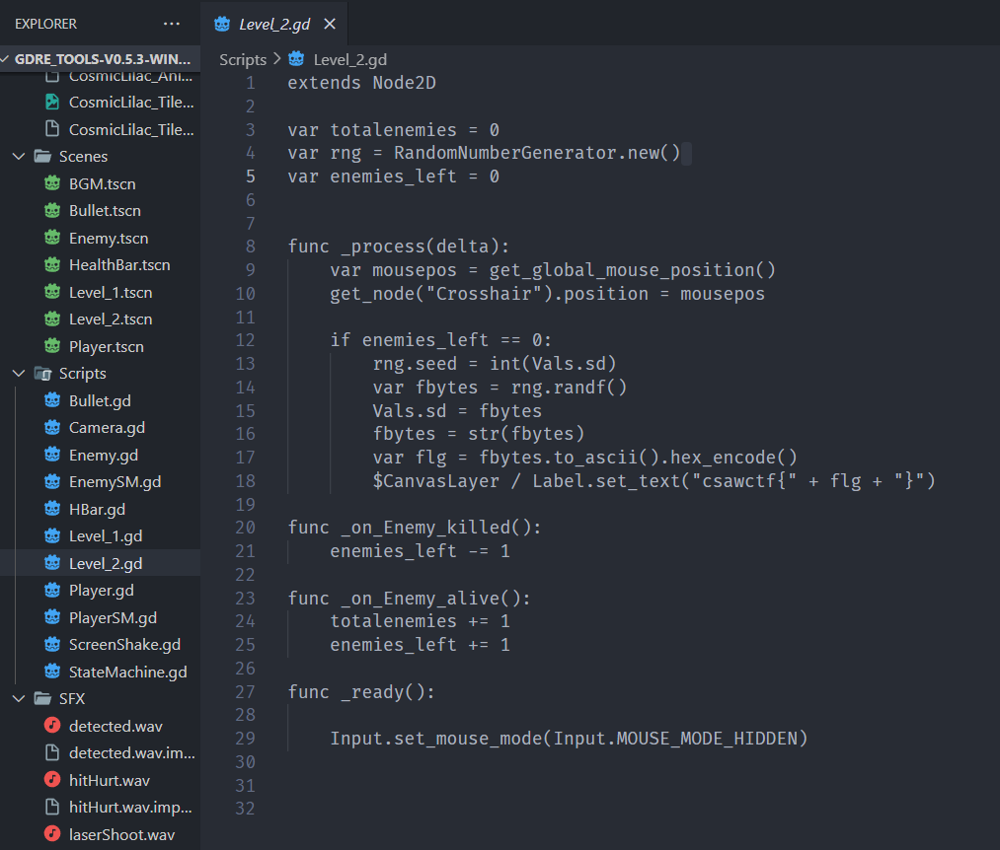

# rebug1

## Solution

- Đọc code của chương trình có thể thấy nó sẽ check `i = 12`. 

    

- Vì vậy ta sẽ tiến hành nhập 1 chuỗi `v8` với độ dài `12` kí tự từ đó sau khi kết thúc vòng for ta sẽ được giá trị `i = 12`

    ```
    ⚡halston ❯❯ ./test.out
    Enter the String: AAAAAAAAAAAA
    that's correct!
    csawctf{c20ad4d76fe97759aa27a0c99bff6710}
    ```
- Hoặc ta có thể patch chương trình để lấy flag. Bằng cách debug.
    
    

## Flag
`csawctf{c20ad4d76fe97759aa27a0c99bff6710}`

# rebug2

## Solution

- Ta có thể nhìn thấy luồng thực thi của chương trình. Nó sẽ gen ra Flag tại hàm `xoring`. Vì vậy tiến hành debug để lấy ra data tại đó.

    

- Có thể thấy được không gặp khó khăn gì trong vấn đề debug.
    

## Flag
`csawctf{01011100010001110000}`


# Impossibrawler

## Solution

- Ta có được 2 file `Impossibrawler.exe` và `Impossibrawler.pck` có thể nhìn thấy ở đây icon của game từ file exe khá giống GDRE. Đoán ngay được file pck nó sẽ được build bằng GDRE tools. Tiến hành decompile nó.

    

- Sau khi decompile ta thu được rất nhiều file gồm cả âm thanh đồ họa data của game.

    

- Check qua các hàm và có thể thấy rõ rằng tại đây sau khi vượt qua level1 đến với level2 và chiến thắng nó ta sẽ có được flag. Vì chơi game khá là khó vì bắn vào mục tiêu ta sẽ không tiêu diệt được nó (khả năng tác giả cố tình làm vậy để làm khó chúng ta). Vì vậy ta sẽ viết lại đoạn code này bằng `GDScript` để đồng bộ cùng chương trình.


    ```
    extends Node

    var rng = RandomNumberGenerator.new()

    func _ready():
        rng.seed = 0
        var fbytes1 = str(rng.randf())
        var flg = fbytes1.to_ascii().hex_encode()
        print("csawctf{" + flg + "}")
        pass
    ```

## Flag
`csawctf{302e323032323732}`

# rox

## Solution

## Flag