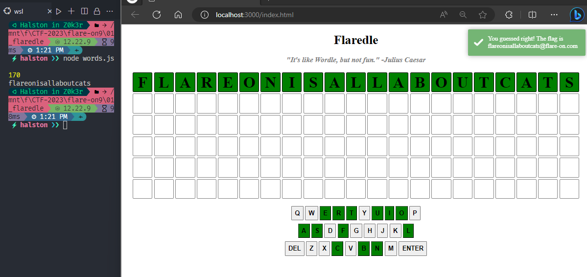
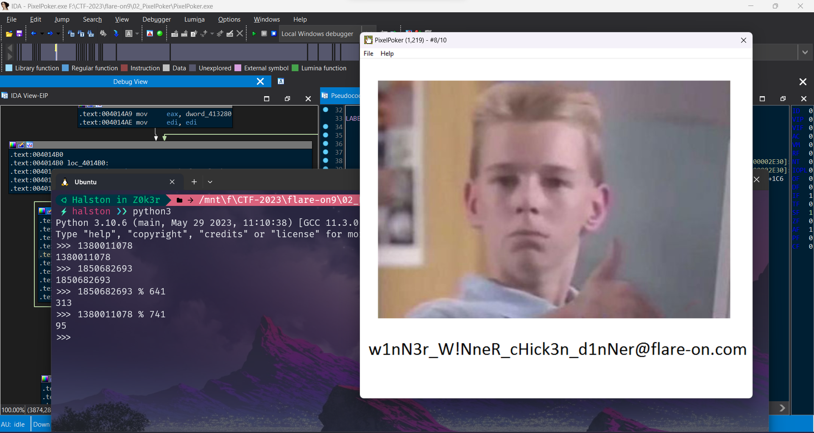
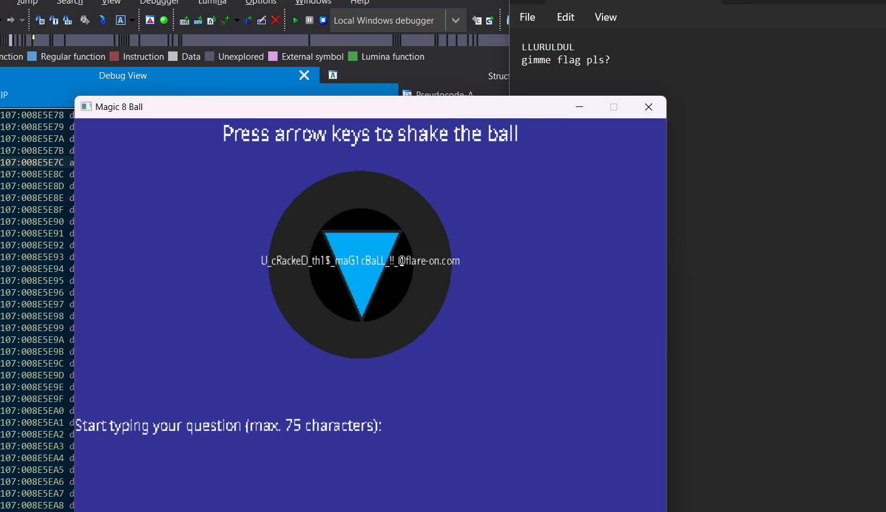
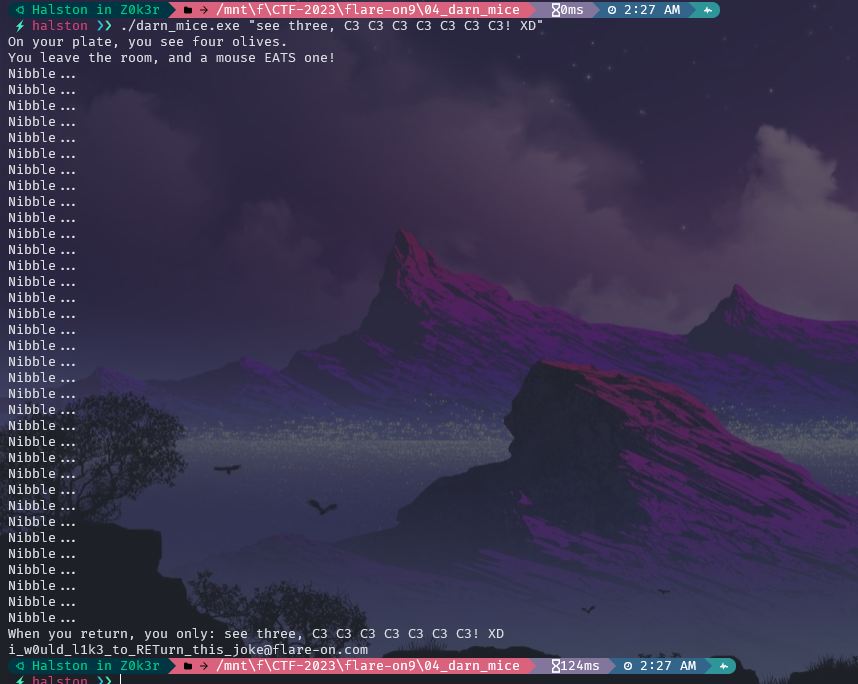

# 01_FLAREDLE

## Solution

- Ta sẽ tập trung phân tích file `scripts.js` và file `words.js` trong đây chứa các data mà chúng ta cần tìm.

- Các biến được khai báo trong `scripts.js`.
  
  ```
  const NUMBER_OF_GUESSES = 6;
  const WORD_LENGTH = 21;
  const CORRECT_GUESS = 57;
  let guessesRemaining = NUMBER_OF_GUESSES;
  let currentGuess = [];
  let nextLetter = 0;
  let rightGuessString = WORDS[CORRECT_GUESS];
  ```

- Ở đây có thể thấy tác giả đã cho khá rõ biến correct word nằm tại vị trí thứ 57 trong mảng ` rightGuessString = WORDS[57]` được import data từ file `words.js` 

- Trong function `check()` có check `input` với `rightGuessString` vì vậy ta chỉ cần tìm đến `WORDS[57]` trong `words.js`.
  
  ```
  function checkGuess () {
    if (guessString === rightGuessString) {
        let flag = rightGuessString + '@flare-on.com';
        toastr.options.timeOut = 0;
        toastr.options.onclick = function() {alert(flag);}
        toastr.success('You guessed right! The flag is ' + flag);
  
        guessesRemaining = 0
        return
    }
  }
  ```

- Đây chính là nội dung của `WORDS[57]`:
  
```
const len = WORDS.length;
console.log(len)
console.log(WORDS[57])

// ⚡halston ❯❯ node words.js 
// 170
// flareonisallaboutcats
```

## Flag




# 02_PixelPoker

## Solution

- Trong hàm main sẽ có hàm `sub_401040` là mục tiêu cần chú ý đến để khai thác.

```
ATOM __cdecl sub_401120(HINSTANCE hInstance)
{
  WNDCLASSEXW v2; // [esp+0h] [ebp-30h] BYREF

  v2.cbSize = 48;
  v2.style = 3;
  v2.lpfnWndProc = sub_4012C0;
  v2.cbClsExtra = 0;
  v2.cbWndExtra = 0;
  v2.hInstance = hInstance;
  v2.hIcon = LoadIconW(hInstance, (LPCWSTR)0x6B);
  v2.hCursor = LoadCursorW(0, (LPCWSTR)0x7F00);
  v2.hbrBackground = (HBRUSH)6;
  v2.lpszMenuName = (LPCWSTR)109;
  v2.lpszClassName = &ClassName;
  v2.hIconSm = LoadIconW(hInstance, (LPCWSTR)0x6C);
  return RegisterClassExW(&v2);
}
```
- Vì trong hàm này sẽ tạo ra 1 cửa sổ dạng như messagebox để thông tạo ra những pixel. Trong đó nội dung của cửa sổ là biến `v2.lpfnWndProc`. Biến này có được gọi đến ở hàm `sub_4012C0`.

```
  memset(String, 0, sizeof(String));
  if ( Msg > 273 )
  {
    if ( Msg == 512 )
    {
      _snprintf(String, 0x104u, "PixelPoker (%d,%d) - #%d/%d", (__int16)lParam, SHIWORD(lParam), dword_413298, 10);
      SetWindowTextA(hWnd, String);
      return 0;
    }
    if ( Msg != 513 )
      return DefWindowProcW(hWnd, Msg, wParam, lParam);
    v8 = (__int16)lParam;
    if ( dword_413298 == 10 )
    {
      MessageBoxA(0, "Womp womp... :(", "Please play again!", 0);
      DestroyWindow(hWnd);
LABEL_30:
      _snprintf(String, 0x104u, "PixelPoker (%d,%d) - #%d/%d", v8, SHIWORD(lParam), dword_413298, 10);
      SetWindowTextA(hWnd, String);
      DC = GetDC(hWnd);
      BitBlt(DC, 0, 0, dword_413280, cy, hdc, 0, 0, 0xCC0020u);
      ReleaseDC(hWnd, DC);
      return 0;
    }
    ++dword_413298;
    v9 = dword_413280;
    if ( (__int16)lParam == dword_412004 % (unsigned int)dword_413280 )
    {
      v10 = cy;
      if ( SHIWORD(lParam) == dword_412008 % (unsigned int)cy )
      {
        v11 = 0;
        if ( cy > 0 )
        {
          v12 = dword_413280;
          do
          {
            v13 = 0;
            if ( v12 > 0 )
            {
              do
              {
                sub_4015D0(v13, v11);
                v12 = dword_413280;
                ++v13;
              }
              while ( v13 < dword_413280 );
              v10 = cy;
            }
            ++v11;
          }
          while ( v11 < (int)v10 );
        }
        v8 = (__int16)lParam;
        goto LABEL_30;
      }
      v9 = dword_413280;
    }
    else
    {
      v10 = cy;
    }
    if ( (__int16)lParam < v9 && SHIWORD(lParam) < v10 )
      sub_4015D0((__int16)lParam, SHIWORD(lParam));
    goto LABEL_30;
  }
}
```
- Trọng tâm trong hàm này cần chú ý là giá trị của biên `(unsigned int) dword_413280 )` và biến `(unsigned int)cy )` từ đó mới có thể call được đến hàm mục tiêu cần khai thác là `sub_4015D0`.

```
int __cdecl sub_4015D0(int x, COLORREF y)
{
  int v3; // ecx
  int result; // eax
  int v5; // esi
  char Buffer[260]; // [esp+Ch] [ebp-108h] BYREF
  int v7; // [esp+110h] [ebp-4h]
  int xa; // [esp+11Ch] [ebp+8h]

  memset(Buffer, 0, sizeof(Buffer));
  v3 = x % 32;
  v7 = x % 32;
  result = x / 32;
  xa = x / 32;
  if ( ((1 << (y * dword_413280 + v3)) & *((_DWORD *)lpMem + x / 32 + y * dword_413280)) == 0 )
  {
    v5 = y;
    y = GetPixel(hdc, x, y);
    _snprintf(Buffer, 0x104u, "PixelPoker (%d,%d)", x, v5);
    sub_4011A0(&y, 4, Buffer, strlen(Buffer), &y);
    SetPixel(hdc, x, v5, y & 0xFFFFFF);
    result = (int)lpMem + 4 * v5 * dword_413280 + 4 * xa;
    *(_DWORD *)result |= 1 << (v5 * dword_413280 + v7);
  }
  return result;
}
```

- Chỉ cần debug là sẽ biết được giá trị của 2 biến trên. 
```
.data:00413280 dword_413280 dd 741
.data:00413284 cy dd 641 
```
- Đây là giá trị của 2 biến có sẵn dùng để tính X và Y.
```
.data:00412004 dword_412004 dd 1380011078              
.data:00412008 dword_412008 dd 1850682693
```

- Kết quả.
```
if ( (__int16)lParam == dword_412004 % (unsigned int)dword_413280 )
    {
      v10 = cy;
      if ( SHIWORD(lParam) == dword_412008 % (unsigned int)cy )
      {

>>> 1380011078 % 741
95
>>> 1850682693 % 641
313
```

## Flag



# 03_magic8ball

## Solution
- Phân tích từ hàm main call đến hàm `sub_403690()`. Trong hàm này sẽ set up SDL và sau đó nó sẽ được call đến hàm `int sub_4027A0()`.
- Trong đây sau khi set up 1 cửa sổ `sub_4018F0(Block, "Magic 8 Ball", 0xCu);` để chúng ta có thể tương tác bên trong thì ngay phía dưới có `v3 = sub_402090(Block, 805240832, 805240832, 800, 600);` sẽ set up các đối số cho cửa sổ mở lên sau khi khởi chạy chương trình bao gồm các strings và set up các font chữ, ảnh đính kèm. Ngoài ra có 1 chuỗi string đáng chú ý tại địa chỉ `[edi+5Ch]`.
```
strcpy(this + 92, "gimme flag pls?");
```
```
mov     dword ptr [edi+5Ch], 6D6D6967h
mov     dword ptr [edi+60h], 6C662065h
mov     dword ptr [edi+64h], 70206761h
mov     dword ptr [edi+68h], 3F736Ch
```

- Trong hàm này sẽ là data của chuỗi chúng ta cần nhập vào.
```
    if ( *v12 == 'L' )
    {
      v13 = v4;
      if ( result >= 0x10 )
        v13 = (_BYTE *)*v4;
      if ( v13[1] == 'L' )
      {
        v14 = v4;
        if ( result >= 0x10 )
          v14 = (_BYTE *)*v4;
        if ( v14[2] == 'U' )
        {
          v15 = v4;
          if ( result >= 0x10 )
            v15 = (_BYTE *)*v4;
          if ( v15[3] == 'R' )
          {
            v16 = v4;
            if ( result >= 0x10 )
              v16 = (_BYTE *)*v4;
            if ( v16[4] == 'U' )
            {
              v17 = v4;
              if ( result >= 0x10 )
                v17 = (_BYTE *)*v4;
              if ( v17[5] == 'L' )
              {
                v18 = v4;
                if ( result >= 0x10 )
                  v18 = (_BYTE *)*v4;
                if ( v18[6] == 'D' )
                {
                  v19 = v4;
                  if ( result >= 0x10 )
                    v19 = (_BYTE *)*v4;
                  if ( v19[7] == 'U' )
                  {
                    v20 = v4;
                    if ( result >= 0x10 )
                      v20 = (_BYTE *)*v4;
                    if ( v20[8] == 'L' )
                    {
                      v21 = (const char *)(this + 248);
                      if ( *(_DWORD *)(this + 268) >= 0x10u )
                        v21 = *(const char **)v21;
                      result = strncmp(v21, (const char *)(this + 92), 0xFu);
                      if ( !result )
                      {
                        sub_401220(v4);
                        return sub_401A10(v22, v23, v24, v25, v26, v27);
                      }
                    }
                  }
                }
              }
            }
          }
        }
```

- Sau khi check chuỗi press keys là `LLURULDUL` sẽ có 1 hàm check chuỗi.
```
result = strncmp(v21, (const char *)(this + 92), 0xFu);
if ( !result ){
  sub_401220(v4);
  return sub_401A10(v22, v23, v24, v25, v26, v27);
}
```
- Tại đây nó cũng call đến địa chỉ `[edi+5Ch]` để cmp strings vì vậy đây chính là chuỗi `gimme flag pls?`.


## Flag




# 04_darn_mice

## Solution

- Ta có data của `v5` 
```
qmemcpy(v5, "P^^", 3);
  v5[3] = -93;
  v5[4] = 79;
  v5[5] = 91;
  v5[6] = 81;
  v5[7] = 94;
  v5[8] = 94;
  v5[9] = -105;
  v5[10] = -93;
  v5[11] = 0x80;
  v5[12] = -112;
  v5[13] = -93;
  v5[14] = 0x80;
  v5[15] = -112;
  v5[16] = -93;
  v5[17] = 0x80;
  v5[18] = -112;
  v5[19] = -93;
  v5[20] = 0x80;
  v5[21] = -112;
  v5[22] = -93;
  v5[23] = 0x80;
  v5[24] = -112;
  v5[25] = -93;
  v5[26] = 0x80;
  v5[27] = -112;
  v5[28] = -93;
  v5[29] = 0x80;
  v5[30] = -112;
  v5[31] = -94;
  v5[32] = -93;
  v5[33] = 107;
  v5[34] = 127;
  v5[35] = 0;
```
- Trong đây vùng nhớ được virtualalloc sẽ trả về địa chỉ được phân bổ vào biến `v2`.

```
 for ( i = 0; i < 0x24 && v5[i] && Str[i]; ++i )
  {
    v2 = (void (__cdecl *)(_DWORD))VirtualAlloc(0, 0x1000u, 0x3000u, 0x40u);
    *(_BYTE *)v2 = Str[i] + v5[i];
    v2(v2);
    print(aNibble);                             // Nibble...
  }
```
- Để chương trình không bị out và tiếp tục thực hiện vòng lặp for ta sẽ điều hướng cho nó quay trở lại vòng lặp đùng luồng của chương trình. Vì vậy ở đây ta sẽ sử dụng lệnh `ret`/.

- Để `v2` trở thành ret. Ta sẽ lấy `ret - v5` => từ đó có thể tìm đc input đầu vào.

```
 Halston in Z0k3r    /mnt\f\CTF-2023\flare-on9\04_darn_mice  ﮫ 28.508s   2:40 AM  
 ⚡halston ❯❯ python3 s.py
see three, C3 C3 C3 C3 C3 C3 C3! XD
 Halston in Z0k3r    /mnt\f\CTF-2023\flare-on9\04_darn_mice  ﮫ 54ms   2:40 AM  
 ⚡halston ❯❯ cat s.py
v5 = [0x50, 0x5E, 0x5E, 0xA3, 0x4F, 0x5B, 0x51, 0x5E, 0x5E, 0x97, 0xA3, 0x80, 0x90, 0xA3, 0x80, 0x90, 0xA3, 0x80, 0x90, 0xA3, 0x80, 0x90, 0xA3, 0x80, 0x90, 0xA3, 0x80, 0x90, 0xA3, 0x80, 0x90, 0xA2, 0xA3, 0x6B, 0x7F]
print("".join([chr(0xC3 - m) for m in v5]))
```

## Flag


