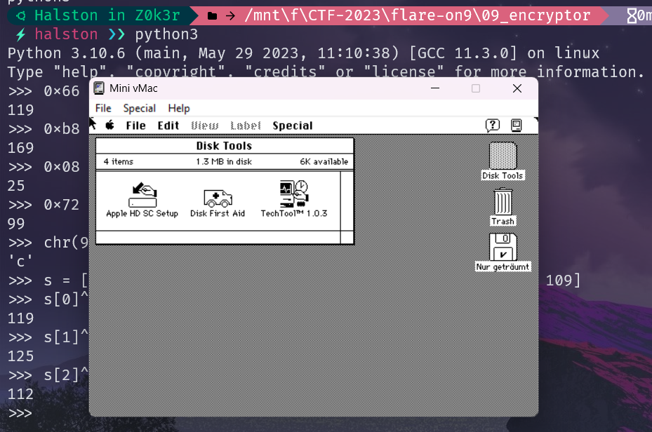
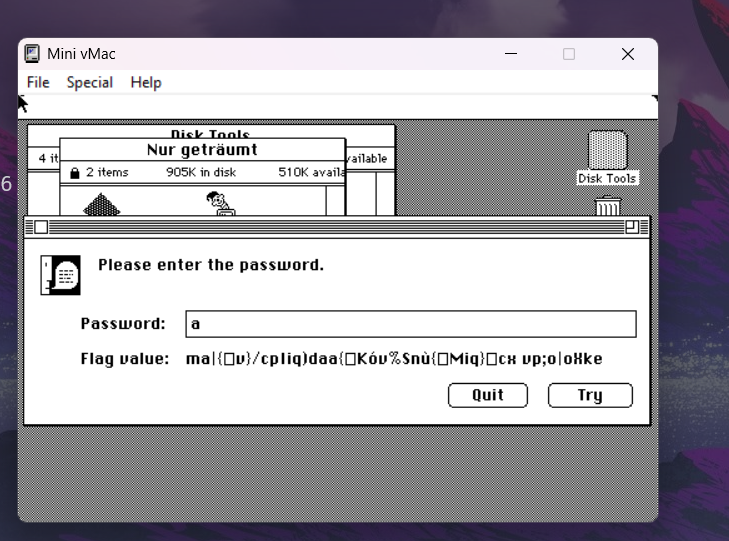
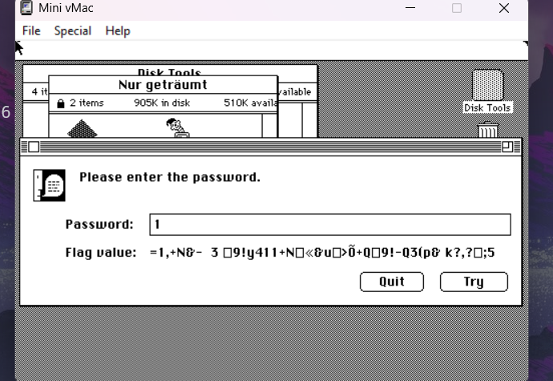
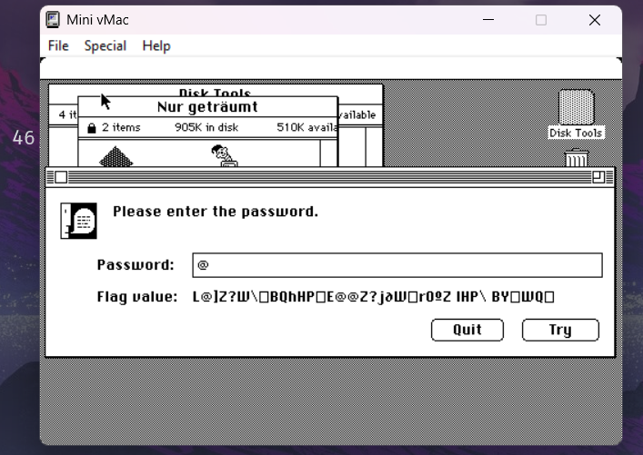
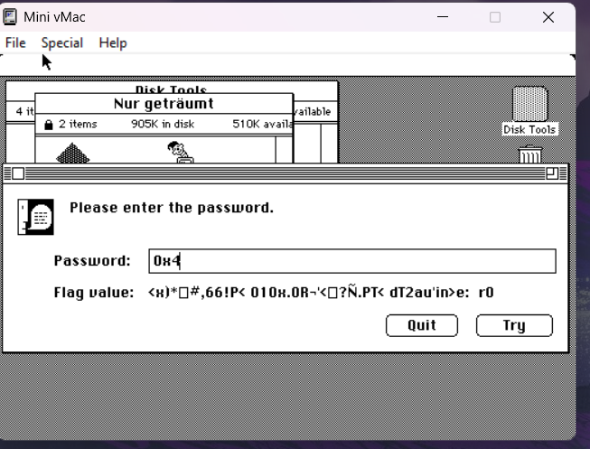
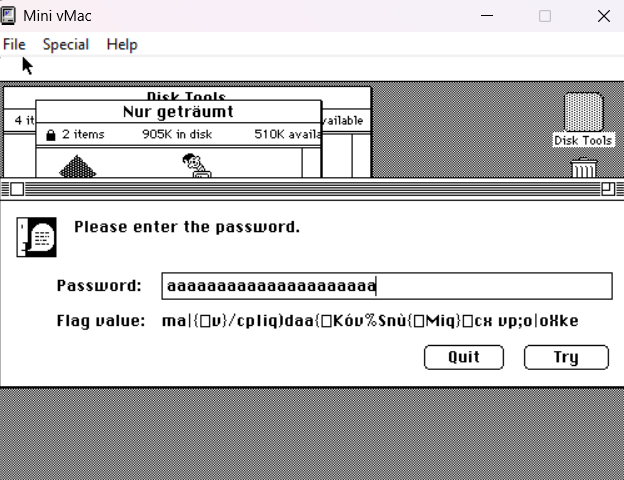
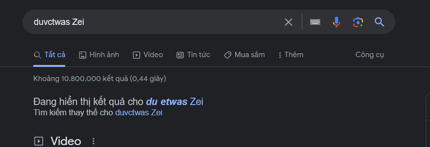
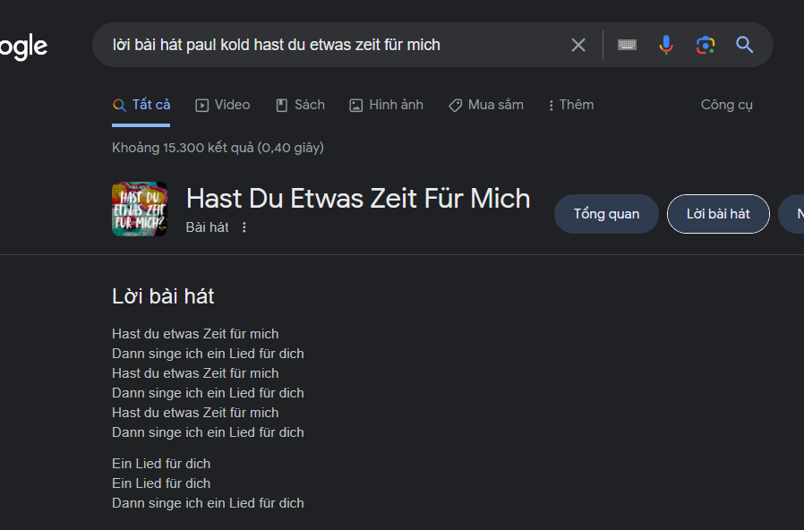

# 10 

## Solution

- Sau 1 lúc tìm hiểu về tool và cách sử dụng ta sẽ phân tích nó bằng MiniMAc
    

- Chạy chương trình với các input khác nhau: 

- Với `a`:

    

- Với `1`

    

- với `@`

    

- với `4`

    

    
- Có thể hiểu chương trình này là cứ nhập 1 đoạn mật khẩu nó sẽ trả cho ta 1 đoạn FLAG bị mã hóa. Có lẽ việc bây giờ của chúng ta sẽ là tìm cách để tìm ra thuật toán được ẩn giấu trong đây.

- Thử cầm chuỗi @flare-on.com để xor lại với cipher xem ra được giá trị nào. 

    

- Với chuỗi mật khẩu này ta lấy được các byte cuối là `p;o|oXke` ta sẽ xor lại nó với `a` và cầm xor thử với `e-on.com` 

    ```
    s = "CXVP"
    x = "flar"
    b = [0] * len(s)

    for i in range(len(s)):
        b[i] = ord(s[i]) ^ ord('A') ^ ord(x[i])
        
    print("".join(chr(i) for i in b))

    s = 'p;o|oXke'
    x = 'e-on.com'
    b = [0] * len(s)

    for i in range(len(s)):
        b[i] = ord(s[i]) ^ ord('a') ^ ord(x[i])
        
    print("".join(chr(i) for i in b))

    ⚡ndinh ❯❯ python -u "f:\CTF-2023\flare-on9\Writeup\s.py"
    duvc
    twas Zei
    ```

- Search thử chuỗi này trên mạng và được trỏ đến kết quả sau:

    

    

    

## Flag
- Có thể thấy dòng thứ 2 của bài hát là flag tuy xor có thể sai vì bảng mã chữ cái nhưng vẫn có thể lấy flag bằng cách này.

    