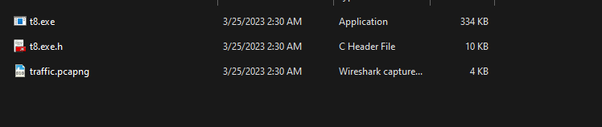
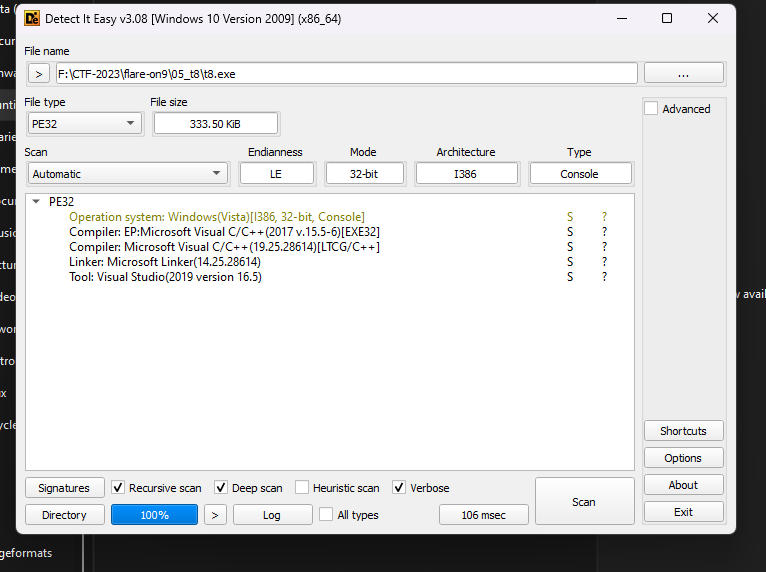
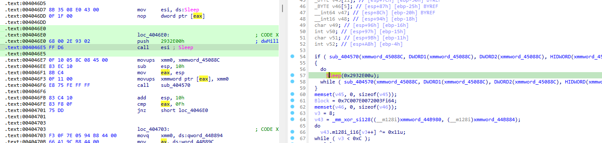
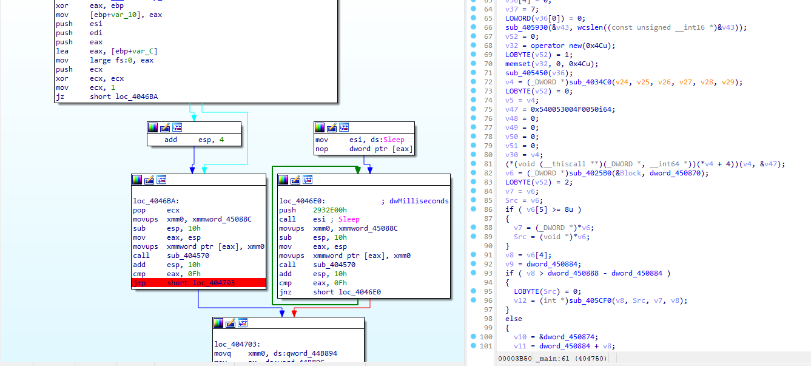
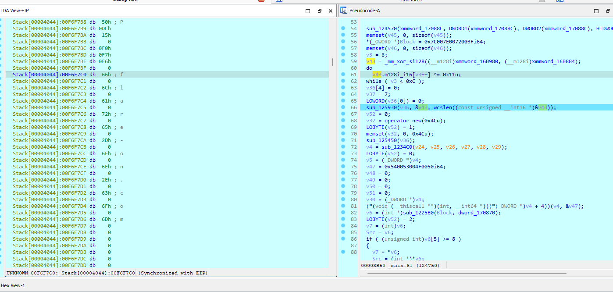

# T8

## Solution
- Đề bài cấp cho ta các file như sau:
    

- Tiến hành check file với detect it easy
    

- File được biên dịch từ C++ qua ngoài ra còn đính kèm file pcap để check quá trình giao tiếp.

    ```
    POST / HTTP/1.1
    Connection: Keep-Alive
    User-Agent: Mozilla/4.0 (compatible; MSIE 7.0; Windows NT 6.1; WOW64; Trident/4.0; SLCC2; .NET CLR 2.0.50727; .NET CLR 3.5.30729; .NET CLR 3.0.30729; Media Center PC 6.0; .NET4.0C; .NET4.0E; 11950)
    Content-Length: 24
    Host: flare-on.com

    y.d.N.8.B.X.q.1.6.R.E.=.HTTP/1.0 200 OK
    Server: Apache On 9 
    Date: Tue, 14 Jun 2022 16:14:36 GMT

    TdQdBRa1nxGU06dbB27E7SQ7TJ2+cd7zstLXRQcLbmh2nTvDm1p5IfT/Cu0JxShk6tHQBRWwPlo9zA1dISfslkLgGDs41WK12ibWIflqLE4Yq3OYIEnLNjwVHrjL2U4Lu3ms+HQc4nfMWXPgcOHb4fhokk93/AJd5GTuC5z+4YsmgRh1Z90yinLBKB+fmGUyagT6gon/KHmJdvAOQ8nAnl8K/0XG+8zYQbZRwgY6tHvvpfyn9OXCyuct5/cOi8KWgALvVHQWafrp8qB/JtT+t5zmnezQlp3zPL4sj2CJfcUTK5copbZCyHexVD4jJN+LezJEtrDXP1DJNg==
    ```

    ```
    POST / HTTP/1.1
    Connection: Keep-Alive
    User-Agent: Mozilla/4.0 (compatible; MSIE 7.0; Windows NT 6.1; WOW64; Trident/4.0; SLCC2; .NET CLR 2.0.50727; .NET CLR 3.5.30729; .NET CLR 3.0.30729; Media Center PC 6.0; .NET4.0C; .NET4.0E; CLR)
    Content-Length: 16
    Host: flare-on.com

    V.Y.B.U.p.Z.d.G.HTTP/1.0 200 OK
    Server: Apache On 9 
    Date: Tue, 14 Jun 2022 16:14:36 GMT

    F1KFlZbNGuKQxrTD/ORwudM8S8kKiL5F906YlR8TKd8XrKPeDYZ0HouiBamyQf9/Ns7u3C2UEMLoCA0B8EuZp1FpwnedVjPSdZFjkieYqWzKA7up+LYe9B4dmAUM2lYkmBSqPJYT6nEg27n3X656MMOxNIHt0HsOD0d+
    ```

- Cả 2 đoạn mã trên được truyền qua đến 1 địa chỉ là `Host: flare-on.com` và chỉ có sự khác biệt ở `User-Agent`.


- Tiến hành bóc tách file exe để xem có những gì.

    

- Tại đây chúng ta sẽ patch qua sleep để khi run chương trình sẽ không bị sleep tại đây. ngay phía dưới đó chính là phần xor chuỗi để tạo ra chuỗi `flare-on.com`.

    


    ```
    .text:00404750                               loc_404750:                             ; CODE XREF: _main+DA↓j
    .text:00404750 66 83 74 45 B8 11             xor     word ptr [ebp+eax*2+var_48], 11h
    .text:00404756 40                            inc     eax
    .text:00404757 83 F8 0C                      cmp     eax, 0Ch
    .text:0040475A 72 F4                         jb      short loc_404750
    ```

- Debug đến đây có thể thấy rõ hơn.    
    

- Sau khi đọc hết chương trình trong ida ta rút ra được những kết luận về mind set của chall này là như sau:

    - Bắt đầu từ chức năng, backdoor thực hiện các hành động sau.main() Giải mã (một byte XOR) tên miền của máy chủ Command and Control ().flare-on.com.

    - Khởi tạo một đối tượng, đây là một lớp tùy chỉnh chịu trách nhiệm giao tiếp với máy chủ Command and Control (thông qua HTTP).CClientSock
    Đặt kiểu yêu cầu HTTP của đối tượng thành .POST

    - Tính toán hàm băm MD5 của chuỗi được nối với một số ngẫu nhiên và sử dụng hàm băm kết quả làm khóa RC4.FO9

    - Mã hóa payload() bằng khóa RC4 trước đó và mã hóa kết quả bằng base64.ahoy

    - Nối số ngẫu nhiên được sử dụng để xây dựng khóa RC4 vào Tác nhân người dùng của yêu cầu.

    - Gửi yêu cầu đến máy chủ Command and Control. Giải mã (base64) và giải mã phản hồi bằng cùng một khóa RC4.

    - Phân tích cú pháp và giải mã phản hồi được giải mã bằng thuật toán tùy chỉnh.

    - Tính toán hàm băm MD5 của việc nối kết quả bước trước đó và (về cơ bản cung cấp cờ), hàm băm kết quả được sử dụng làm khóa RC4 thứ hai `@flare-on.com`

    - Mã hóa payload () bằng khóa RC4 mới này, mã hóa kết quả bằng base64 và gửi yêu cầu đến máy chủ Command and Control.sce Giải mã (base64) và giải mã (khóa thứ hai) phản hồi.

    - Phản hồi được giải mã tương ứng với một shellcode, được ánh xạ và thực thi ngay lập tức.

- Mục tiêu đầu tiên là lấy lại chìa khóa RC4 ban đầu. Điều này yêu cầu trích xuất số ngẫu nhiên được thêm vào Tác nhân người dùng của yêu cầu đầu tiên từ PCAP.


- Tiến hành lấy khóa RC4 ban đầu có thể được thực hiện trong một vài dòng Python.

    ```
    import hashlib

    to_wide = lambda x : x.encode("utf-16")[2:]

    rand_num = 11950

    m = hashlib.md5()
    m.update(to_wide("FO9") + to_wide(str(rand_num)))
    print(m.hexdigest()) # a5c6993299429aa7b900211d4a279848
    ```

- Khi chúng ta có khóa RC4 ban đầu, chúng ta có thể giải mã, giải mã và phân tích cú pháp phản hồi cho yêu cầu đầu tiên.

- Vì thuật toán được sử dụng để giải mã phản hồi được giải mã hơi khó đảo ngược (xem mã tại ), tôi đã sử dụng tính năng Appcall của IDA để thiết bị cho hàm `0x404570`

    ```
    import struct
    import ida_idd
    from base64 import b64decode
    from Crypto.Cipher import ARC4

    upck32 = lambda x : struct.unpack("I", x)[0]

    rc4_key = "a5c6993299429aa7b900211d4a279848".encode('utf-16')[2:]
    response = b"TdQdBRa1nxGU06dbB27E7SQ7TJ2+cd7zstLXRQcLbmh2nTvDm1p5IfT/Cu0JxShk6tHQBRWwPlo9zA1dISfslkLgGDs41WK12ibWIflqLE4Yq3OYIEnLNjwVHrjL2U4Lu3ms+HQc4nfMWXPgcOHb4fhokk93/AJd5GTuC5z+4YsmgRh1Z90yinLBKB+fmGUyagT6gon/KHmJdvAOQ8nAnl8K/0XG+8zYQbZRwgY6tHvvpfyn9OXCyuct5/cOi8KWgALvVHQWafrp8qB/JtT+t5zmnezQlp3zPL4sj2CJfcUTK5copbZCyHexVD4jJN+LezJEtrDXP1DJNg=="

    response_dec = ARC4.new(rc4_key).decrypt(b64decode(response))

    flag = []
    for chunk in response_dec.split(b",\x00"):
        dec_chunk = ida_idd.Appcall.decode_chunk(upck32(chunk[:4]), upck32(chunk[4:8]), upck32(chunk[8:12]), upck32(chunk[12:]))
        dec_char = ida_idd.Appcall.chunk_to_char(dec_chunk)
        flag.append(dec_char)
        
    print(bytes(flag).decode() + "@flare-on.com")
    ```


## Flag
`is33you_m00n@flare-on.com`