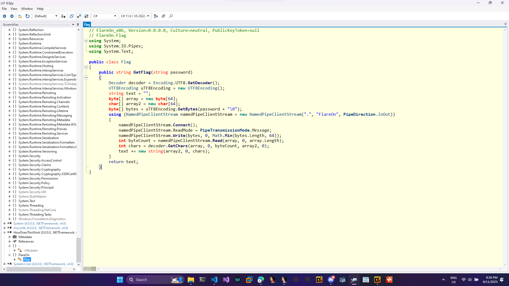
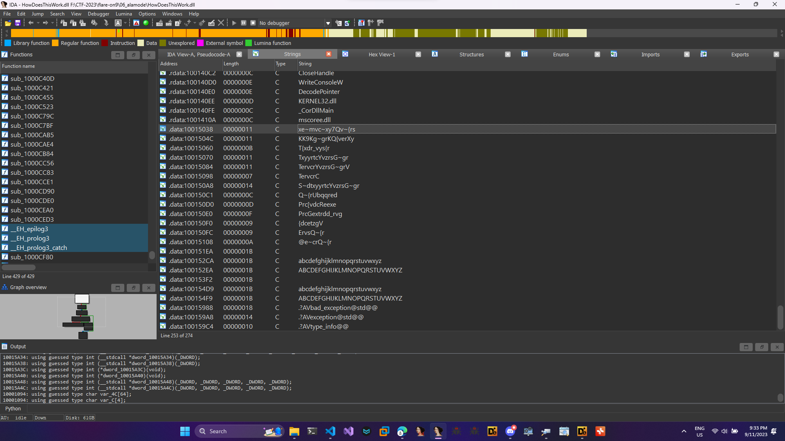
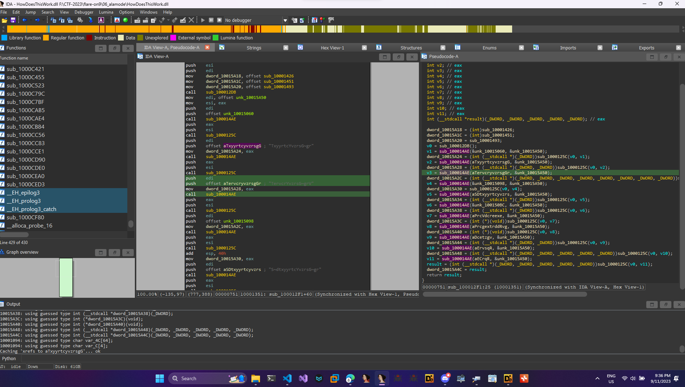
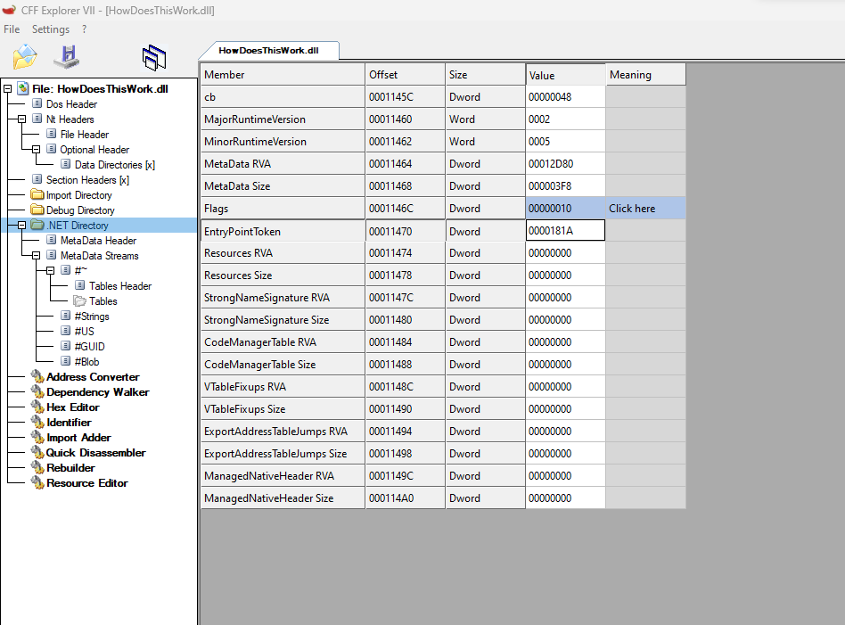
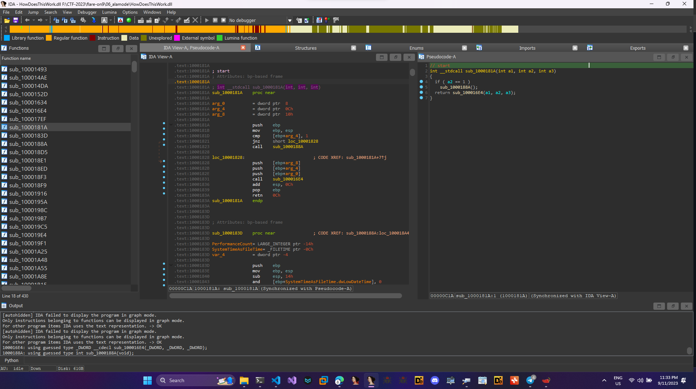
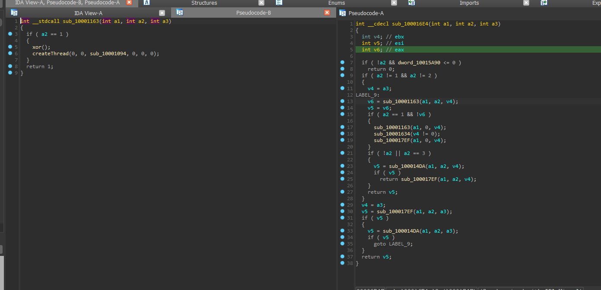
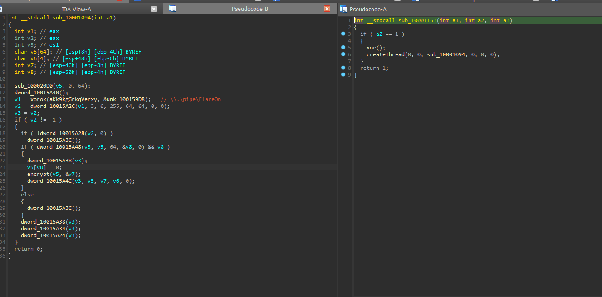
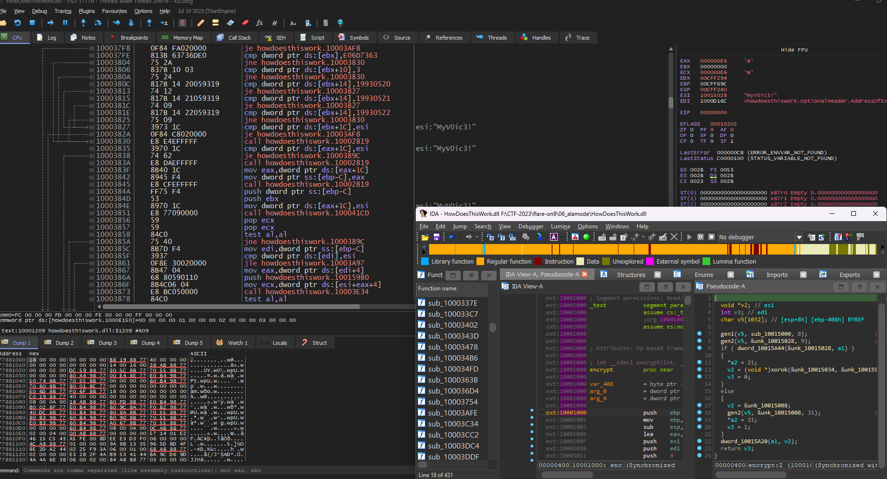
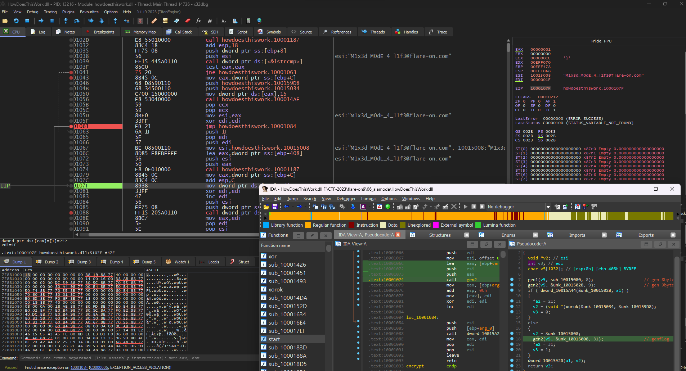

# 06_alamode
## SOLUTION
- Ta được cho 1 file `dll` sau khi ném vào `detect it easy` thì có thể thấy file này được biên dịch sử dụng file library build từ `.NET` và có được biên dịch bằng `C/C++`.

    

- Decompile file dll này ta được source code của nó

    

    ```
    // FlareOn_x86, Version=0.0.0.0, Culture=neutral, PublicKeyToken=null
    // FlareOn.Flag
    using System;
    using System.IO.Pipes;
    using System.Text;

    public class Flag
    {
        public string GetFlag(string password)
        {
            Decoder decoder = Encoding.UTF8.GetDecoder();
            UTF8Encoding uTF8Encoding = new UTF8Encoding();
            string text = "";
            byte[] array = new byte[64];
            char[] array2 = new char[64];
            byte[] bytes = uTF8Encoding.GetBytes(password + "\0");
            using (NamedPipeClientStream namedPipeClientStream = new NamedPipeClientStream(".", "FlareOn", PipeDirection.InOut))
            {
                namedPipeClientStream.Connect();
                namedPipeClientStream.ReadMode = PipeTransmissionMode.Message;
                namedPipeClientStream.Write(bytes, 0, Math.Min(bytes.Length, 64));
                int byteCount = namedPipeClientStream.Read(array, 0, array.Length);
                int chars = decoder.GetChars(array, 0, byteCount, array2, 0);
                text += new string(array2, 0, chars);
            }
            return text;
        }
    }

    ```
- Đọc qua đoạn code có thể thấy đây chính là hàm để lấy `Flag` nó được truyền đối số là `password` và sau đó connect đến `NamedPipeClientStream` và sau đó xử lý với `password` ta truyền vào và trả về `flag`.

- Tiến hành phân tích với `IDA`. Check qua 1 lượt strings thấy có khá nhiều string đáng nghi ngờ. Ta sẽ jump đến các strings xem chúng xử lý như thế nào với các strings này.

    

- Các strings trên được call đến liên tục trong hàm `sub_100014AE()`. Cùng phân tích trong hàm này.

    

- Có thể thấy rằng trong đây nó sẽ thực hiện truyền vào và xor chuỗi với `0x17` sau đó trả về nội dung của chuỗi. Tiến hành decode chúng.
    ```
    int __cdecl sub_100014AE(char *a1, int a2)
    {
    char *v2; // ecx
    int v3; // esi
    char i; // al

    v2 = a1;
    v3 = 0;
    for ( i = *a1; *v2; i = *v2 )
    {
        ++v3;
        (v2++)[a2 - (_DWORD)a1] = i ^ 0x17;
    }
    *(_BYTE *)(v3 + a2) = 0;
    return a2;
    }
    ```

- Sau khi decode ta có được các chuỗi như sau đây chính là cách nó call api nhưng mã hóa hàm api.
    ```
    v1 = "T{xdr_vys{r"
    v2 = "TxyyrtcYvzrsG~gr"
    v3 = "TervcrYvzrsG~grV"
    v4 = "TervcrC\x7Fervs"
    v5 = "S~dtxyyrtcYvzrsG~gr"
    v6 = "Q{bd\x7FQ~{rUbqqred"
    v7 = "Prc[vdcReexe"
    v8 = "PrcGextrdd_rvg"
    v9 = "{dcetzgV"
    v10 = "ErvsQ~{r"
    v11 = "@e~crQ~{r"
    aKk9kgGrkqVerxy = "KK9Kg~grKQ{verXy"
    aVbcXeMvcXy7qvR = "Vbc\x7Fxe~mvc~xy7Qv~{rs"
    def x(v):
        f = ""
        for i in range(len(v)):
            f += chr(ord(v[i]) ^ 0x17)
        
        return f

    print(x(v1))
    print(x(v2))
    print(x(v3))
    print(x(v4))
    print(x(v5))
    print(x(v6))
    print(x(v7))
    print(x(v8))
    print(x(v9))
    print(x(v10))
    print(x(v11))
    print(x(aKk9kgGrkqVerxy))
    print(x(aVbcXeMvcXy7qvR))


    #  Halston    F:\CTF-2023\flare-on9\Writeup  ﮫ 61ms   9:45 PM  
    #  ⚡ndinh ❯❯ python -u "f:\CTF-2023\flare-on9\Writeup\decode.py"
    # CloseHandle
    # ConnectNamedPipe
    # CreateNamedPipeA
    # CreateThread
    # DisconnectNamedPipe
    # FlushFileBuffers
    # GetLastError
    # GetProcessHeap
    # lstrcmpA
    # ReadFile
    # WriteFile
    # \\.\pipe\FlareOn
    # Authorization Failed
    ```
- Khi mở ida ta được trỏ đến entrypoint nhưng khi check trong CFF ta sẽ có 1 entrypoint khác `0x1000181A`.

    

- Sau khi make code ta có được 1 hàm như sau:

    
- Trong đây ta sẽ đi vào hàm `sub_100016E4()` tại đây sẽ có 1 hàm xor với 0x17 để ra các kí tự như trên ta đã decrypt.

    

- Sau khi `xor` xong ta sẽ check hàm tiếp theo ở dưới `sub_10001094`

    ```
    int __stdcall sub_10001094(int a1)
    {
    int v1; // eax
    int v2; // eax
    int v3; // esi
    char v5[64]; // [esp+8h] [ebp-4Ch] BYREF
    char v6[4]; // [esp+48h] [ebp-Ch] BYREF
    int v7; // [esp+4Ch] [ebp-8h] BYREF
    int v8; // [esp+50h] [ebp-4h] BYREF

    sub_100020D0(v5, 0, 64);
    dword_10015A40();
    v1 = xorok(aKk9kgGrkqVerxy, &unk_100159D8);   // \\.\pipe\FlareOn
    v2 = createName(v1, 3, 6, 255, 64, 64, 0, 0);
    v3 = v2;
    if ( v2 != -1 )
    {
        if ( !dword_10015A28(v2, 0) )
        dword_10015A3C();
        if ( dword_10015A48(v3, v5, 64, &v8, 0) && v8 )
        {
        dword_10015A38(v3);
        v5[v8] = 0;
        encrypt(v5, &v7);                         // encflag
        dword_10015A4C(v3, v5, v7, v6, 0);
        }
        else
        {
        dword_10015A3C();
        }
        dword_10015A38(v3);
        dword_10015A34(v3);
        dword_10015A24(v3);
    }
    return 0;
    }
    ```
    
- Mục tiêu của chúng ta sẽ là hàm `encrypt()`. Trong đây sẽ gồm key và data sử dụng thuật toán để lấy flag ở gen flag.
    ```
    int __cdecl encrypt(int a1, _DWORD *a2)
    {
    void *v2; // esi
    int v3; // edi
    char v5[1032]; // [esp+8h] [ebp-408h] BYREF

    gen1(v5, sub_10015000, 8);                    // gen 8bytes
    gen2(v5, &unk_10015028, 9);                   // gen 9bytes
    if ( dword_10015A44(&unk_10015028, a1) )
    {
        *a2 = 21;
        v2 = (void *)xorok(&unk_10015034, &unk_100159D8);
        v3 = 0;
    }
    else
    {
        v2 = &unk_10015008;
        gen2(v5, &unk_10015008, 31);                // genflag
        *a2 = 31;
        v3 = 1;
    }
    dword_10015A20(a1, v2);
    return v3;
    }
    ```

- Ta sẽ debug bằng x32dbg để jmp đến `encrypt` sau đó có thể jmp đến flag được gen. Khi jmp chưa patch thì sẽ gen được key là `MyV0ic3!`

    

## FLAG
- Ta sẽ patch để chương trình đi qua gen1 và gen2 sau đó sẽ đến genflag để lấy đc flag.

    
- Sau khi đến createThread ta sẽ jump luôn đến genFlag để lấy flag. Vậy Flag là `M1x3d_M0dE_4_l1f3@flare-on.com`
