# 07_anode

## Solution
- Nhìn vào thông tin của file có thể thấy đây là 1 file node.js được biên dịch thành file anode.exe vì vậy ta sẽ tiến hành decompile nó lại thành file source code ban đầu.
- Sử dụng `nexe_unpacker` để decompile nó.

    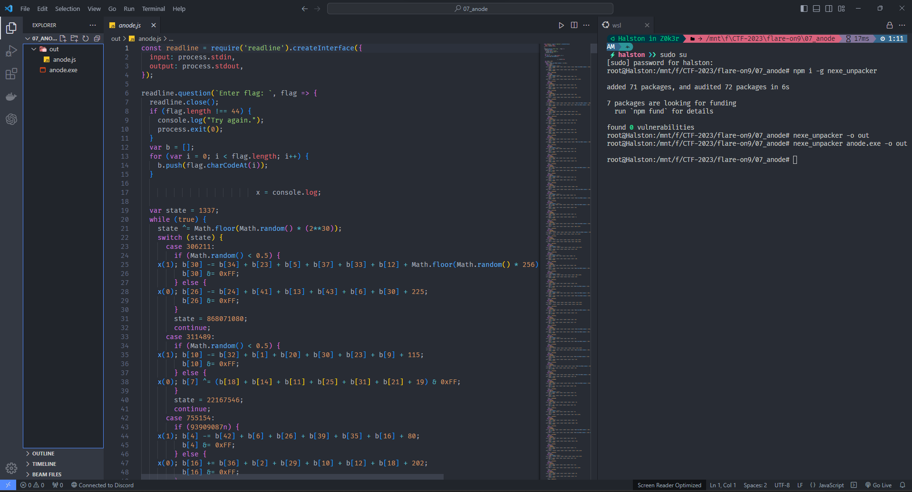

- Đoạn code này khá là dài 9000 dòng code vì vậy ta sẽ cố gắng đọc những thứ quan trọng và được chắt lọc tốt nhất.

- Tại đây có thể thấy được length của `Flag` sẽ có độ dài bằng 44.

    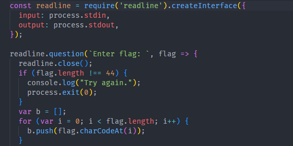

- Tiếp theo nó sẽ là các nhánh `switch case` có thể nhìn thấy khá là rối mắt.

    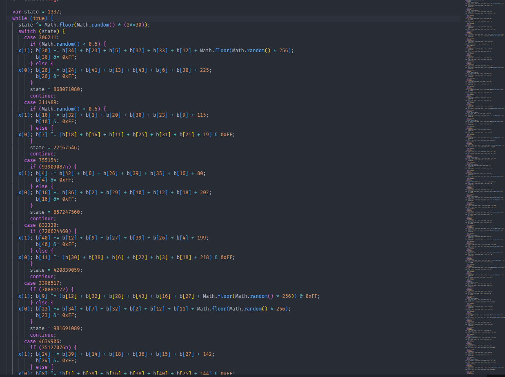
   
- Thử nhập 44 kí tự "A" vào thì nó sẽ check flag cho mình.

    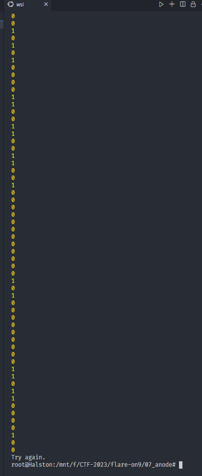
    
- Kéo xuống dưới cùng có thể nhìn thấy tại đây nó sẽ check data bị decrypt sau đó check với mảng `target` vậy target chính là cipher mà chúng ta cần decode lại.

    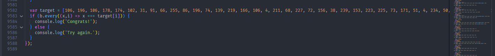
 
- Nhìn vào code và sau khi chạy nó với `node` có thể thấy nó bị obfuscated và ngoài ra nó còn bị sai đi luồng chương trình. Vì khi ta thử chạy với 44 kí tự khác nó lại in ra chuỗi không đúng như tôi mong đợi là `Try again.` khác với khi ta chạy bằng file exe. Điều này thật khó hiểu.

    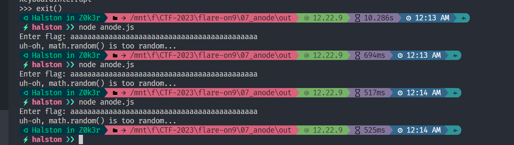
    
- Sau khi tìm hiểu ta có được 1 mind set về cách thức của tác giả đối với bài này. Họ đã sử dụng `Control Flow Flattening` để làm xáo trộn luồng thực thi của chương trình khiến nó khó có thể đọc hơn và các cấu trúc code cơ bản hiện tại đã biến mất.

    `https://jscrambler.com/blog/jscrambler-101-control-flow-flattening`

- Câu lệnh if (...) kỳ lạ. Ví dụ: if (1n) phải luôn đúng nhưng thực tế không phải vậy.

- Math.random() không trả về giá trị thực sự ngẫu nhiên. (ví dụ: trường hợp mặc định trong câu lệnh switch không bao giờ được thực thi)
 
    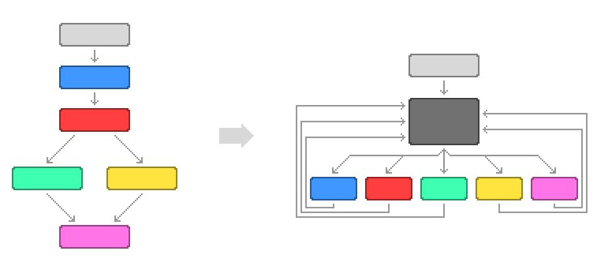
`Biểu đồ luồng điều khiển (CFG)`
- Vì vậy chúng ta cần làm luồng điều khiển trở lại ban đầu không bị CFF. Nhìn vào sơ đồ có thể thấy CFG sau khi bị CFF nó sẽ bị làm phẳng ra và sau khi câu lệnh được gọi nó sẽ quay trở lại khối đen (hay còn gọi là khối điều kiện chính) và tiếp tục lặp lại khối này để chọn nhánh tiếp theo hướng đến.

- Vì vậy cách dễ nhất để xử lý CFF là theo dõi luồng thực thi và sau đó xây dựng lại CFG ban đầu.
    
- Nhưng trong trường hợp này, ta có khá nhiều rào cản vì đoạn code khá là dài ngoài ra còn về môi trường compile code.

   
## Code deobfuscation
- Bước đầu tiên để mã độc lập hoạt động bình thường là khôi phục các giá trị Math.random().

- Ta sẽ thử biên dịch lại file và sửa code để check xem các giá trị tham chiếu của mảng `b` trước khi so sánh với cipher.

    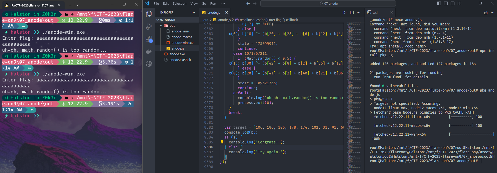

- Nhưng chương trình lại chạy sai luồng như ta không mong muốn vì vậy sẽ chuyển hướng sử dụng `Hxd` để sửa hex sau đó thử chạy lại với file exe.

    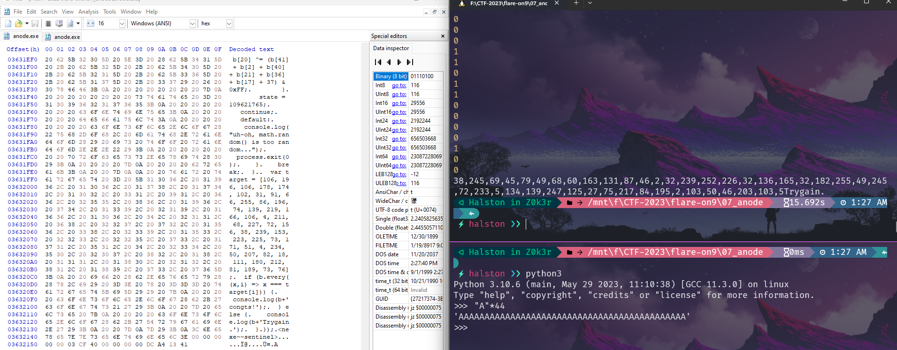

- Để mỗi lần run chương trình không bị `uh-oh, math.random() is too random...` ta sẽ sửa luồng thực thi của if else như sau
    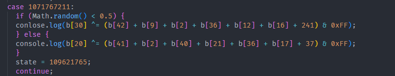


- Đến đây ta sẽ sử dụng regex để regex lại các byte ta muốn chỉnh sửa và không bị rác. Vậy ta sẽ thêm vào 2048 lần chỉnh sửa.

    

- Ý tưởng sẽ là regex như sau:

    ```
    re.sub(b'(b\[\d+\] .= .{10,});', b'console.log("\\1");', js)
    re.sub(b'Math.floor\(Math\.random\(\) \* 256\)', b'" + Math.floor(Math.random() * 256) + "', new_js)
    re.sub(b'\n +', b'\n', new_js)
    ```

## Flag


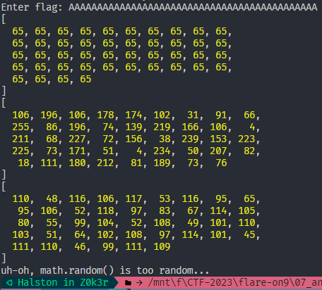


```
⚡ndinh ❯❯ python -u "f:\CTF-2023\flare-on9\07_anode\out\s.py"
n0tju5t_A_j4vaSCriP7ch4l1eng3@flare-on.com
```

