# 08_BackDoor

## Solution

- Bước đầu tiên lúc nào cũng là check file. NHận thấy đây là file được biên dịch từ .NET qua exe vì vậy ta sẽ sử dụng dnspy để xem source decompile của nó.

   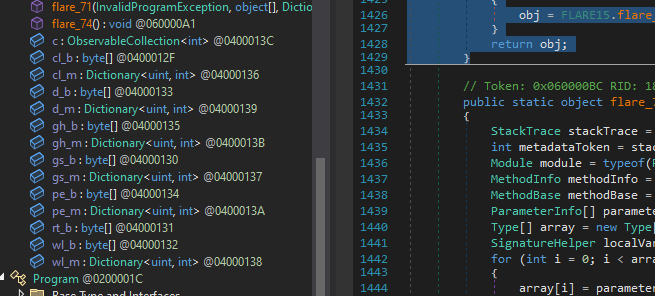

- Có thể thấy nó được sắp xếp không xáo trộn 

    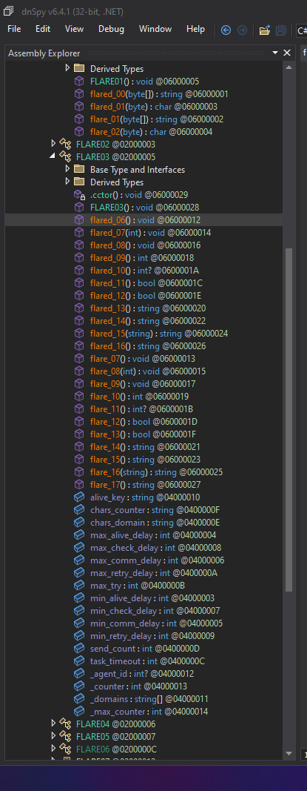

- Tất cả các hàm như thế này đều không thể reverse trong dnspy

    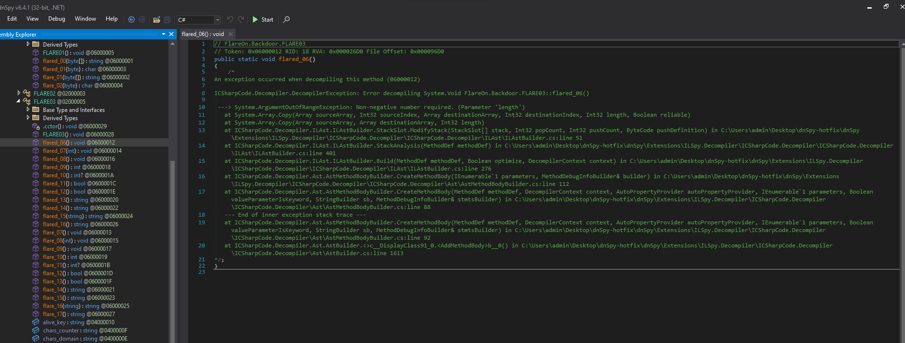

- Tìm đến main để xem luồng thực thi của chương trình.

    

    ```
    // FlareOn.Backdoor.Program
    // Token: 0x06000069 RID: 105 RVA: 0x00004038 File Offset: 0x0000B038
    public static void Main(string[] args)
    {
        try
        {
            try
            {
                FLARE15.flare_74();
                Program.flared_38(args);
            }
            catch (InvalidProgramException ex)
            {
                FLARE15.flare_70(ex, new object[] { args });
            }
        }
        catch
        {
        }
    }

    ```
- Hàm sẽ cố gắng gọi một hàm Flared_* tương ứng, có cùng chữ ký hàm (kiểu đối số và giá trị trả về) và lưu kết quả trả về vào một biến được gọi là kết quả. Nếu hàm Flared_* ném ra Ngoại lệ InvalidProgramException thì ngoại lệ đó sẽ bị bắt và chuyển tới Flare_71 hoặc Flare_70. Trong cả hai trường hợp, ngoại lệ và một mảng các đối số ban đầu đều được truyền vào. Đối với các trường hợp flame_71, hai giá trị khác cũng được truyền vào, đó là các biến trong FLARE15. Ngay cả flame_70 cũng phù hợp với mẫu này:


    ```
    public static object flare_70(InvalidProgramException e, object[] a)
            {
                object obj;
                try
                {
                    obj = FLARE15.flared_70(e, a);
                }
                catch (InvalidProgramException ex)
                {
                    obj = FLARE15.flare_71(ex, new object[] { e, a }, FLARE15.wl_m, FLARE15.wl_b);
                }
                return obj;
            }
    ```

- Tại main nó đã call đến flare_74() đầu tiên

    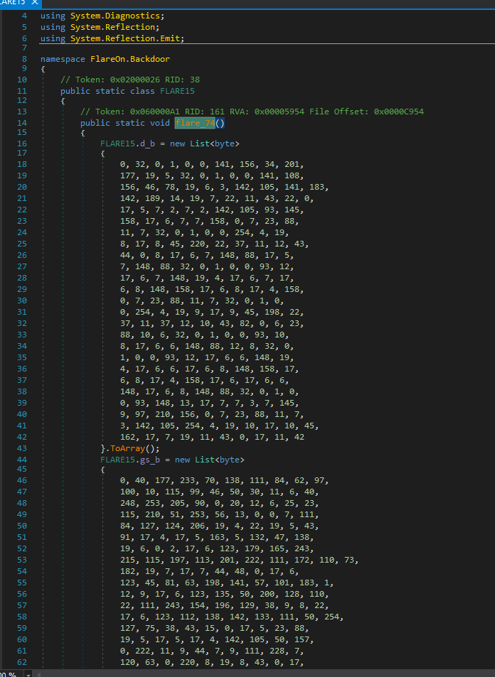

- Trong flare_74() sẽ là 1 đống data theo kinh nghiệm dev đề thì chắc chắn đống data này có thể chạy qua thuật toán gen ra png, gif, exe,... 


- Bước qua bước này, Flare_74 chỉ hoạt động tốt, nhưng Flared_38 ném ra một InvalidProgramException, được chuyển đến Flare_70 (như được hiển thị ở trên, cố gắng gọi Flared_70, tự ném một ngoại lệ và được chuyển đến Flared_71).

- flare_74 khác với phần còn lại ở chỗ nó thiếu định dạng ngoại lệ gọi / tạo. Thay vào đó, nó chỉ đơn giản là khởi tạo các biến trong FLARE15.

    

### Deobfuscation

- DNSpy sẽ không hiển thị mã được cập nhật khi nó thực thi. Để xem những hàm này đang làm gì, tôi sẽ cần vá tệp nhị phân bằng các hàm chính xác. Điều này có thể đạt được bằng cách lấy từng mảng byte _b và vá các mã thông báo siêu dữ liệu từ từ điển _m. Tôi sẽ lưu từng tệp này vào một tệp có tên patch_bufs.py bằng cách sao chép chúng ra khỏi DNSpy và sử dụng để nhanh chóng định dạng lại chúng thành các tệp Python tương đương.

- Sau khi patch xong ta sẽ lấy được đoạn code đẹp như sau:
    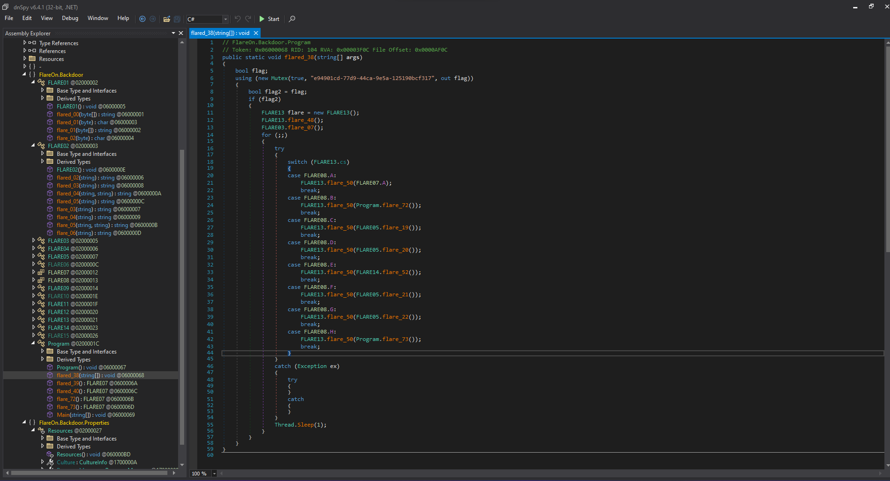

- Nó tạo ra một mutex (để đảm bảo chỉ có một phiên bản chạy tại một thời điểm), tạo đối tượng FLARE13, gọi một vài hàm rồi chuyển sang vòng lặp vô hạn trên FLARE13.cs. FLARE13 trông giống như một loại máy trạng thái. FLARE08 là một cấu trúc enum, có thể là các trạng thái:

    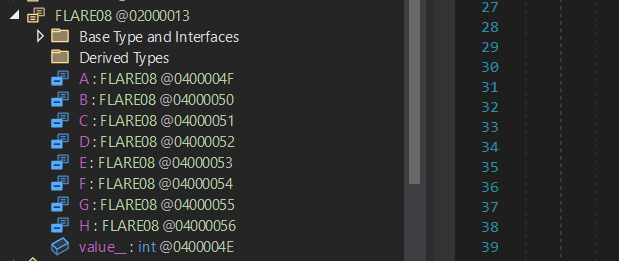

- A - H là các giá trị không đổi 0 - 8. loe_50 lấy FLARE07 làm đối số. Trong trường hợp đầu tiên, nó cần một cái tĩnh. Phần còn lại gọi một hàm phải trả về FLARE07.

- Flare_50, giống như hầu hết các hàm còn lại, cố gắng gọi Flare_50, với một ngoại lệ được bắt và chuyển đến Flare_70. Để thực sự hiểu chuyện gì đang xảy ra, tôi cần hiểu cách hoạt động của flame_70. Nó thực sự chỉ là một trình bao bọc để gọi Flared_70 đã được giải mã bởi Flare_71, nhưng trong tệp nhị phân đã vá của tôi, tôi chỉ có thể nhìn vào Flared_70:

    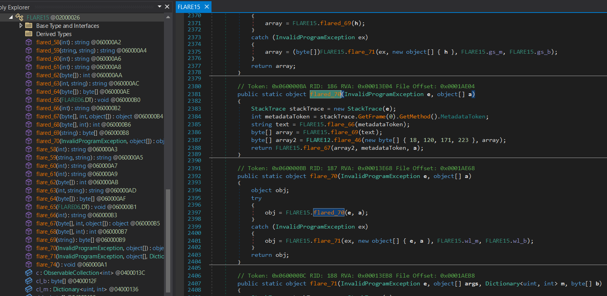

- Bốn hàm cục bộ được gọi ở đây đều là những hàm được xử lý bởi flame_71, vì vậy bây giờ chúng đã rõ ràng.

- lore_70 thực hiện các bước sau:

    - Nhận mã thông báo siêu dữ liệu cho hàm mà hàm đã kích hoạt ngoại lệ.
    Chuyển nó tới Flared_66 sẽ tập hợp một loạt dữ liệu về hàm và băm nó, trả về hàm băm SHA256.
    - Hàm băm được chuyển đến Flare_69, lặp qua tất cả các tiêu đề của phần, tìm kiếm phần đầu khớp với phần đầu của hàm băm và trả về dữ liệu trong phần đó.
    - Dữ liệu được chuyển tới Flare_47, đây là một hàm RC4 đơn giản, với khóa 4 byte tĩnh.
    - Bộ đệm kết quả được chuyển đến bùng lên_67, cùng với mã thông báo siêu dữ liệu và các đối số ban đầu cho hàm.
    - Flare_67 tương tự như Flare_71 nhưng có một số điểm khác biệt. Nó bắt đầu bằng việc xác định một từ điển lớn, tương tự như các biến m từ flame_71. Nó thực hiện công việc tương tự để lấy các biến và tham số cục bộ cho hàm bị hỏng, sau đó lặp qua bộ đệm đầu vào, b. Nó phức tạp hơn một chút trong cách xác định và thay thế mã thông báo, nhưng ở mức độ cao, rõ ràng là nếu trường hợp là FLARE06.OT.B, thì nó thực hiện tương tự như trong flame_71 với mã thông báo, chỉ có điều nó cũng có để áp dụng XOR trước:

    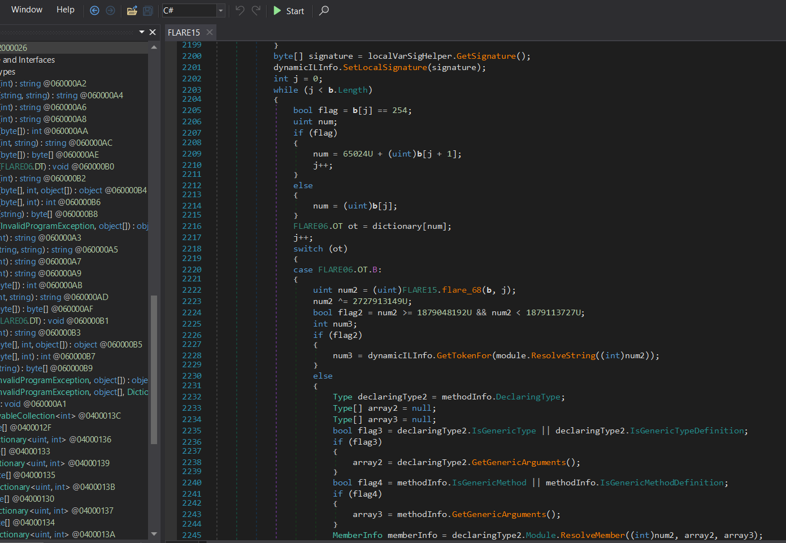

- Sau khi lọc xong các strings ta sẽ có được đoạn data như sau:
    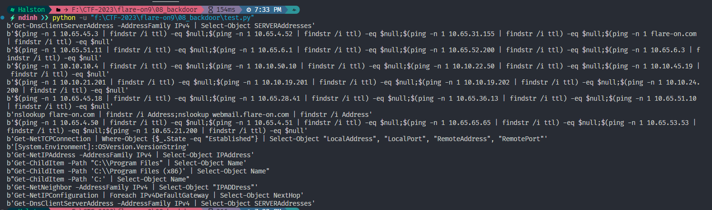

    ```
    Một số cơ chế của chương trình này sau khi phân tích:
        Tất cả các hàm sử dụng dynamic func
        Flare71 là main chính
        Tự động bỏ các exeption để call main
        Tất cả “_flared” đều tạo ra exception
        Sử dụng kết quả của hàm trước làm đối số cho hàm tiếp theo
    ```

- Func1 (flare_70), flared_70, size = 0x55:  sử dụng dict4 (wl_m), bytes4 (wl_b): gọi Func2 khi thực thi

- Func2 (flare_66), flared_66, size = 0x20C: mã thông báo 't' = 0x06000068 trả về thứ gì đó như hàm băm sha256, h=result="ffc58f783ea75c62c4afa6527e902ce857152317cf4dbcbe5947e4dd 23705f4e"

- Func3 (flare_69), flared_69, size = 0xAC:  đã sử dụng dict2 (gs_m), bytes2(gs_b): sử dụng "h" làm đối số lấy đường dẫn của tệp hiện tại, gán cho f: f = @"F:\CTF-2023\flare-on9\08_backdoor\FlareOn.Backdoor.exe", gọi func4 bên trong

- Func4 (flare_37), flared_35, size = 0x9b:  dùng f làm đối số, không trả về bất cứ thứ gì, dùng Filestream, đặt đường dẫn này, đặt file ghi id tác nhân vào thư mục hiện tại

- Có thể sử dụng đường dẫn này để gọi IMAGE_SECTION_HEADER đối với chỉ mục trong tệp, nếu h.startwith(read(8)) thì tìm vị trí đó, được sử dụng để truy xuất phần sau đó sử dụng phần bù này để tìm kiếm, đọc byte và RC4 và thực hiện điều này.

    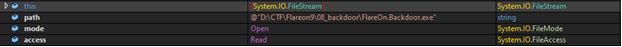

- Sử dụng tìm kiếm để đặt vị trí mới đọc: ví dụ: 0xB08E00 -> đọc 85 byte thành d.

    ```
    d=bytes.fromhex(‘96488C31A2BB25C804EED3FDC4346B9DAE18F569E9E07914F7B196329154286091E4F69766BDB82DCF791AA887F2CE05A6A4B2BF68ABB13C4BC421B64AFCD1C2A707D5B37279454BE3390A6188AFC0278753C45046’)
    ```

- Sau đó quay trở lại Flare_69. Lần này sẽ sử dụng ILspy vì không quen với DNspy.

    

- Func5 (flare_46) (flared_47), size = 0xFA, reversed:used bytes1 (d_b), dict1 (d_m), use and d as parameter
(RC4) key = p = [0x12, 0x78, 0xAB, 0xDF], d = encrypted, result = decrypted


    ```
    b=bytes.fromhex(‘00007240A698D27FAFA698A62884A698A82D0772A6A798D22B127FAFA698A62887A698A80A12002886A698A82897A698A87FAEA698A62886A698A82 8A6A698A8288FA698A80000DE060B00160CDE04170C2B00082A')
    ```

- Func 6(flare_67), flared_67, size = 0x412, 0xDDC: used dict3 (), bytes3(cl_b) , (b,tk=0x06000068,o = obj string 0x00 -> agrs)

    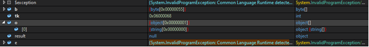

- Có vẻ như cuộc gọi nhiều lần, Một mảng 'b' dường như có giá trị mới, lệnh gọi trực tiếp flame_76 tới Flare_71, sử dụng các byte trước đó làm mã opcode IL, sử dụng tk làm mã thông báo, có thể là một hàm mới.

- Func7 (flare_68),size = 0x37, reversed:(rt_b). chỉ cần byte dài, chỉ cần đặt mã thông báo cho byte.

    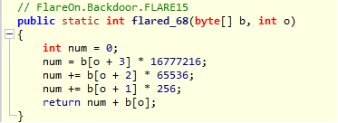

    ````
    ^0x.[0-9A-F]$
    ````
- Có thể nó đã sử dụng lệnh giải mã RC4 sang IL, chạy lệnh này dưới dạng hàm động mới.

- RC4 được sử dụng để giải mã một func khác, có cùng khóa, sau đó lored_38 thực sự là main, đọc byte đó, sau đó giải mã, sau đó ghi byte đó để gọi.

- Luồng chính được đảo ngược để giải mã tất cả chức năng.
- Flare_70 được gọi trước cho Flare_71 (Resolve_dynamic_method), Flare_70 và Flare_71 đang cố gắng giải quyết một số hàm tích hợp với một số byte và từ điển được cung cấp:
    - nhận được hàm băm bùng lên_66
    - làm bùng lên đường dẫn_69
    - tìm phần theo hàm băm bùng lên_35
    - lấy byte từ phần bùng lên_35
    - được giải mã bằng RC4 bùng lên_47
    - tạo hàm động với byte, mã thông báo, đối số được cung cấp bùng_67
    - đặt mã thông báo (bên trong Flare_67, có thể lặp lại nhiều lần) Flare_68
- Sau đó lặp lại để giải mã tất cả chức năng. Có thể là hàm đầu tiên có byte 0xF8 là hàm chính bùng lên_38. Cố gắng lấy byte trước khi đặt mã thông báo (hoặc trước khi gọi setcode()), sau đó vá byte đó vào đúng vị trí

## Flag

- Script solve:

    ```
    import arc4
    import hashlib

    def Powershell(c):
        return "powershell -exec bypass -enc \"" + c + "\""
            
    f = open("FlareOn.Backdoor.exe",'rb').read()
    dict_cmd = {
        19:Powershell("JChwaW5nIC1uIDEgMTAuNjUuNDUuMyB8IGZpbmRzdHIgL2kgdHRsKSAtZXEgJG51bGw7JChwaW5nIC1uIDEgMTAuNjUuNC41MiB8IGZpbmRzdHIgL2kgdHRsKSAtZXEgJG51bGw7JChwaW5nIC1uIDEgMTAuNjUuMzEuMTU1IHwgZmluZHN0ciAvaSB0dGwpIC1lcSAkbnVsbDskKHBpbmcgLW4gMSBmbGFyZS1vbi5jb20gfCBmaW5kc3RyIC9pIHR0bCkgLWVxICRudWxs"),
        18:Powershell("JAAoAHAAaQBuAGcAIAAtAG4AIAAxACAAMQAwAC4AMQAwAC4AMgAyAC4ANAAyACAAfAAgAGYAaQBuAGQAcwB0AHIAIAAvAGkAIAB0AHQAbAApACAALQBlAHEAIAAkAG4AdQBsAGwAOwAkACgAcABpAG4AZwAgAC0AbgAgADEAIAAxADAALgAxADAALgAyADMALgAyADAAMAAgAHwAIABmAGkAbgBkAHMAdAByACAALwBpACAAdAB0AGwAKQAgAC0AZQBxACAAJABuAHUAbABsADsAJAAoAHAAaQBuAGcAIAAtAG4AIAAxACAAMQAwAC4AMQAwAC4ANAA1AC4AMQA5ACAAfAAgAGYAaQBuAGQAcwB0AHIAIAAvAGkAIAB0AHQAbAApACAALQBlAHEAIAAkAG4AdQBsAGwAOwAkACgAcABpAG4AZwAgAC0AbgAgADEAIAAxADAALgAxADAALgAxADkALgA1ADAAIAB8ACAAZgBpAG4AZABzAHQAcgAgAC8AaQAgAHQAdABsACkAIAAtAGUAcQAgACQAbgB1AGwAbAA="),
        16:Powershell("JAAoAHAAaQBuAGcAIAAtAG4AIAAxACAAMQAwAC4ANgA1AC4ANQAxAC4AMQAxACAAfAAgAGYAaQBuAGQAcwB0AHIAIAAvAGkAIAB0AHQAbAApACAALQBlAHEAIAAkAG4AdQBsAGwAOwAkACgAcABpAG4AZwAgAC0AbgAgADEAIAAxADAALgA2ADUALgA2AC4AMQAgAHwAIABmAGkAbgBkAHMAdAByACAALwBpACAAdAB0AGwAKQAgAC0AZQBxACAAJABuAHUAbABsADsAJAAoAHAAaQBuAGcAIAAtAG4AIAAxACAAMQAwAC4ANgA1AC4ANQAyAC4AMgAwADAAIAB8ACAAZgBpAG4AZABzAHQAcgAgAC8AaQAgAHQAdABsACkAIAAtAGUAcQAgACQAbgB1AGwAbAA7ACQAKABwAGkAbgBnACAALQBuACAAMQAgADEAMAAuADYANQAuADYALgAzACAAfAAgAGYAaQBuAGQAcwB0AHIAIAAvAGkAIAB0AHQAbAApACAALQBlAHEAIAAkAG4AdQBsAGwA"),
        15:Powershell("JAAoAHAAaQBuAGcAIAAtAG4AIAAxACAAMQAwAC4AMQAwAC4AMQAwAC4ANAAgAHwAIABmAGkAbgBkAHMAdAByACAALwBpACAAdAB0AGwAKQAgAC0AZQBxACAAJABuAHUAbABsADsAJAAoAHAAaQBuAGcAIAAtAG4AIAAxACAAMQAwAC4AMQAwAC4ANQAwAC4AMQAwACAAfAAgAGYAaQBuAGQAcwB0AHIAIAAvAGkAIAB0AHQAbAApACAALQBlAHEAIAAkAG4AdQBsAGwAOwAkACgAcABpAG4AZwAgAC0AbgAgADEAIAAxADAALgAxADAALgAyADIALgA1ADAAIAB8ACAAZgBpAG4AZABzAHQAcgAgAC8AaQAgAHQAdABsACkAIAAtAGUAcQAgACQAbgB1AGwAbAA7ACQAKABwAGkAbgBnACAALQBuACAAMQAgADEAMAAuADEAMAAuADQANQAuADEAOQAgAHwAIABmAGkAbgBkAHMAdAByACAALwBpACAAdAB0AGwAKQAgAC0AZQBxACAAJABuAHUAbABsAA=="),
        14:Powershell("JAAoAHAAaQBuAGcAIAAtAG4AIAAxACAAMQAwAC4AMQAwAC4AMgAxAC4AMgAwADEAIAB8ACAAZgBpAG4AZABzAHQAcgAgAC8AaQAgAHQAdABsACkAIAAtAGUAcQAgACQAbgB1AGwAbAA7ACQAKABwAGkAbgBnACAALQBuACAAMQAgADEAMAAuADEAMAAuADEAOQAuADIAMAAxACAAfAAgAGYAaQBuAGQAcwB0AHIAIAAvAGkAIAB0AHQAbAApACAALQBlAHEAIAAkAG4AdQBsAGwAOwAkACgAcABpAG4AZwAgAC0AbgAgADEAIAAxADAALgAxADAALgAxADkALgAyADAAMgAgAHwAIABmAGkAbgBkAHMAdAByACAALwBpACAAdAB0AGwAKQAgAC0AZQBxACAAJABuAHUAbABsADsAJAAoAHAAaQBuAGcAIAAtAG4AIAAxACAAMQAwAC4AMQAwAC4AMgA0AC4AMgAwADAAIAB8ACAAZgBpAG4AZABzAHQAcgAgAC8AaQAgAHQAdABsACkAIAAtAGUAcQAgACQAbgB1AGwAbAA="),
        10:"hostname",
        17:Powershell("JAAoAHAAaQBuAGcAIAAtAG4AIAAxACAAMQAwAC4ANgA1AC4ANAA1AC4AMQA4ACAAfAAgAGYAaQBuAGQAcwB0AHIAIAAvAGkAIAB0AHQAbAApACAALQBlAHEAIAAkAG4AdQBsAGwAOwAkACgAcABpAG4AZwAgAC0AbgAgADEAIAAxADAALgA2ADUALgAyADgALgA0ADEAIAB8ACAAZgBpAG4AZABzAHQAcgAgAC8AaQAgAHQAdABsACkAIAAtAGUAcQAgACQAbgB1AGwAbAA7ACQAKABwAGkAbgBnACAALQBuACAAMQAgADEAMAAuADYANQAuADMANgAuADEAMwAgAHwAIABmAGkAbgBkAHMAdAByACAALwBpACAAdAB0AGwAKQAgAC0AZQBxACAAJABuAHUAbABsADsAJAAoAHAAaQBuAGcAIAAtAG4AIAAxACAAMQAwAC4ANgA1AC4ANQAxAC4AMQAwACAAfAAgAGYAaQBuAGQAcwB0AHIAIAAvAGkAIAB0AHQAbAApACAALQBlAHEAIAAkAG4AdQBsAGwA"),
        13:Powershell("bnNsb29rdXAgZmxhcmUtb24uY29tIHwgZmluZHN0ciAvaSBBZGRyZXNzO25zbG9va3VwIHdlYm1haWwuZmxhcmUtb24uY29tIHwgZmluZHN0ciAvaSBBZGRyZXNz"),
        12:Powershell("JAAoAHAAaQBuAGcAIAAtAG4AIAAxACAAMQAwAC4ANgA1AC4ANAAuADUAMAAgAHwAIABmAGkAbgBkAHMAdAByACAALwBpACAAdAB0AGwAKQAgAC0AZQBxACAAJABuAHUAbABsADsAJAAoAHAAaQBuAGcAIAAtAG4AIAAxACAAMQAwAC4ANgA1AC4ANAAuADUAMQAgAHwAIABmAGkAbgBkAHMAdAByACAALwBpACAAdAB0AGwAKQAgAC0AZQBxACAAJABuAHUAbABsADsAJAAoAHAAaQBuAGcAIAAtAG4AIAAxACAAMQAwAC4ANgA1AC4ANgA1AC4ANgA1ACAAfAAgAGYAaQBuAGQAcwB0AHIAIAAvAGkAIAB0AHQAbAApACAALQBlAHEAIAAkAG4AdQBsAGwAOwAkACgAcABpAG4AZwAgAC0AbgAgADEAIAAxADAALgA2ADUALgA1ADMALgA1ADMAIAB8ACAAZgBpAG4AZABzAHQAcgAgAC8AaQAgAHQAdABsACkAIAAtAGUAcQAgACQAbgB1AGwAbAA7ACQAKABwAGkAbgBnACAALQBuACAAMQAgADEAMAAuADYANQAuADIAMQAuADIAMAAwACAAfAAgAGYAaQBuAGQAcwB0AHIAIAAvAGkAIAB0AHQAbAApACAALQBlAHEAIAAkAG4AdQBsAGwA"),
        11:Powershell("RwBlAHQALQBOAGUAdABUAEMAUABDAG8AbgBuAGUAYwB0AGkAbwBuACAAfAAgAFcAaABlAHIAZQAtAE8AYgBqAGUAYwB0ACAAewAkAF8ALgBTAHQAYQB0AGUAIAAtAGUAcQAgACIARQBzAHQAYQBiAGwAaQBzAGgAZQBkACIAfQAgAHwAIABTAGUAbABlAGMAdAAtAE8AYgBqAGUAYwB0ACAAIgBMAG8AYwBhAGwAQQBkAGQAcgBlAHMAcwAiACwAIAAiAEwAbwBjAGEAbABQAG8AcgB0ACIALAAgACIAUgBlAG0AbwB0AGUAQQBkAGQAcgBlAHMAcwAiACwAIAAiAFIAZQBtAG8AdABlAFAAbwByAHQAIgA="),
        4:Powershell("WwBTAHkAcwB0AGUAbQAuAEUAbgB2AGkAcgBvAG4AbQBlAG4AdABdADoAOgBPAFMAVgBlAHIAcwBpAG8AbgAuAFYAZQByAHMAaQBvAG4AUwB0AHIAaQBuAGcA"),
        5:"net user",
        3:"whoami",
        1:Powershell("RwBlAHQALQBOAGUAdABJAFAAQQBkAGQAcgBlAHMAcwAgAC0AQQBkAGQAcgBlAHMAcwBGAGEAbQBpAGwAeQAgAEkAUAB2ADQAIAB8ACAAUwBlAGwAZQBjAHQALQBPAGIAagBlAGMAdAAgAEkAUABBAGQAZAByAGUAcwBzAA=="),
        7:Powershell("RwBlAHQALQBDAGgAaQBsAGQASQB0AGUAbQAgAC0AUABhAHQAaAAgACIAQwA6AFwAUAByAG8AZwByAGEAbQAgAEYAaQBsAGUAcwAiACAAfAAgAFMAZQBsAGUAYwB0AC0ATwBiAGoAZQBjAHQAIABOAGEAbQBlAA=="),
        8:Powershell("RwBlAHQALQBDAGgAaQBsAGQASQB0AGUAbQAgAC0AUABhAHQAaAAgACcAQwA6AFwAUAByAG8AZwByAGEAbQAgAEYAaQBsAGUAcwAgACgAeAA4ADYAKQAnACAAfAAgAFMAZQBsAGUAYwB0AC0ATwBiAGoAZQBjAHQAIABOAGEAbQBlAA=="),
        9:Powershell("RwBlAHQALQBDAGgAaQBsAGQASQB0AGUAbQAgAC0AUABhAHQAaAAgACcAQwA6ACcAIAB8ACAAUwBlAGwAZQBjAHQALQBPAGIAagBlAGMAdAAgAE4AYQBtAGUA"),
        2:Powershell("RwBlAHQALQBOAGUAdABOAGUAaQBnAGgAYgBvAHIAIAAtAEEAZABkAHIAZQBzAHMARgBhAG0AaQBsAHkAIABJAFAAdgA0ACAAfAAgAFMAZQBsAGUAYwB0AC0ATwBiAGoAZQBjAHQAIAAiAEkAUABBAEQARAByAGUAcwBzACIA"),
        22:"systeminfo | findstr /i \"Domain\"",
        20:Powershell("RwBlAHQALQBOAGUAdABJAFAAQwBvAG4AZgBpAGcAdQByAGEAdABpAG8AbgAgAHwAIABGAG8AcgBlAGEAYwBoACAASQBQAHYANABEAGUAZgBhAHUAbAB0AEcAYQB0AGUAdwBhAHkAIAB8ACAAUwBlAGwAZQBjAHQALQBPAGIAagBlAGMAdAAgAE4AZQB4AHQASABvAHAA"),
        21:Powershell("RwBlAHQALQBEAG4AcwBDAGwAaQBlAG4AdABTAGUAcgB2AGUAcgBBAGQAZAByAGUAcwBzACAALQBBAGQAZAByAGUAcwBzAEYAYQBtAGkAbAB5ACAASQBQAHYANAAgAHwAIABTAGUAbABlAGMAdAAtAE8AYgBqAGUAYwB0ACAAUwBFAFIAVgBFAFIAQQBkAGQAcgBlAHMAcwBlAHMA")
    }
    print(len(dict_cmd))
    trace = b"System.Object InvokeMethod(System.Object, System.Object[], System.Signature, Boolean)System.Object Invoke(System.Object, System.Reflection.BindingFlags, System.Reflection.Binder, System.Object[], System.Globalization.CultureInfo)"

    order_of_command_exec = [2, 10, 8, 19, 11, 1, 15, 13, 22, 16, 5, 12, 21, 3, 18, 17, 20, 14, 9, 7]

    h = hashlib.sha256()
    data = b""
    for i in order_of_command_exec:
        h.update(trace + dict_cmd[i].encode())
    key = h.digest()
    print(key.hex())
    # key = bytes([148,76,238,77,66,88,58,83,232,26,126,165,201,220,43,182,185,1,33,58,14,179,40,108,166,157,63,1,239,132,172,187])
    arc = arc4.ARC4(key)
    offset = 0x0024200 
    length = 0xae4800
    data = f[offset:offset+length]
    decrypted = arc.decrypt(data)
    print(decrypted)
    filename = arc.decrypt(bytes([31,29,40,72]))
    f = open('flag','wb')
    f.write(decrypted)

    ```

- Flag:
    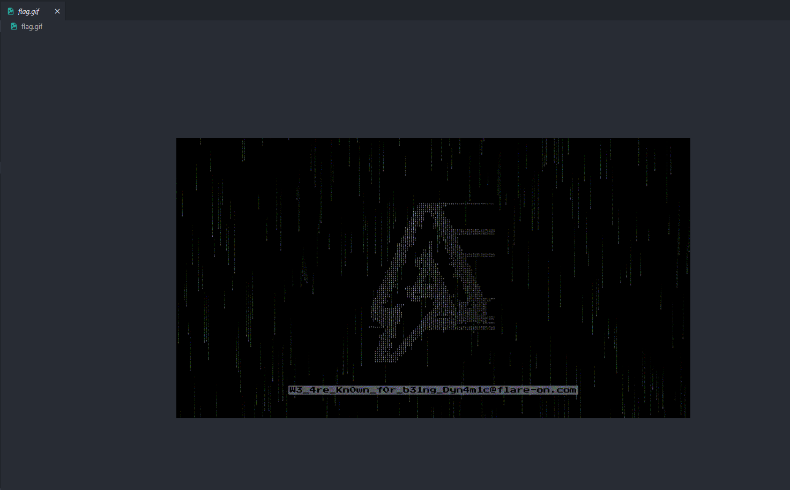
