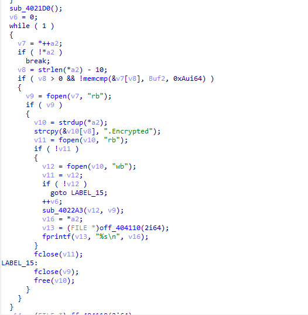
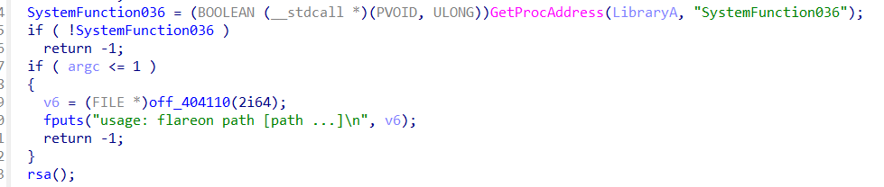
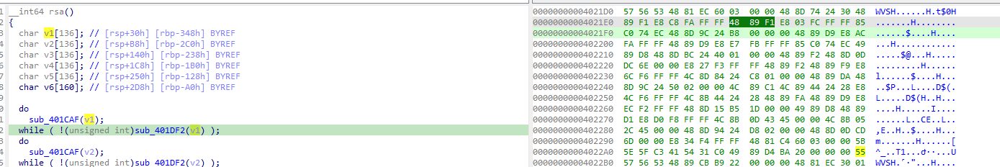
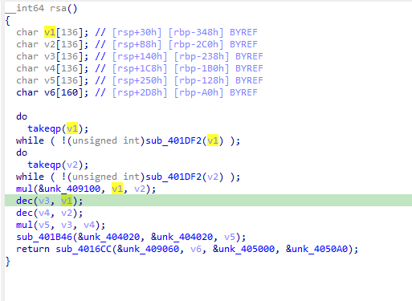
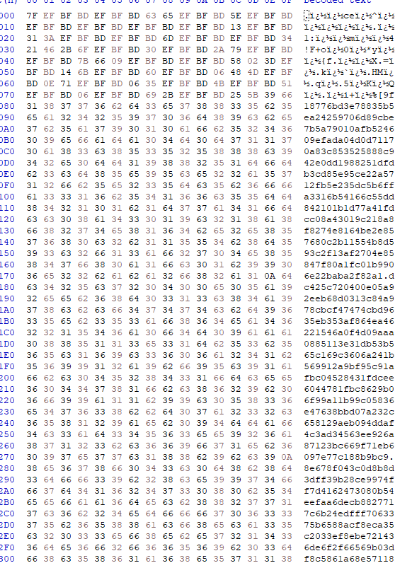

# Encryptor

## Solution

- Ta sẽ phải chạy file với đối số nếu nó <= 1 thì sẽ in ra sai và cần chạy lại với đối số.

    

- Sau khi đọc xong phần này có thể nhận thấy file exe sẽ chạy kèm đối số là 1 file khác sau đó nó sẽ encrypt file này thành 1 file `.EncryptMe`.

    

- Sau khi phân tích full hàm này có thể thấy nó sẽ check đối số nhập vào vì vậy ta sẽ đổi nó thành main và đi theo xuống dưới sẽ thấy 1 hàm là rsa được call đến ngay sau khi check đối số nhập vào của chương trình.

    

- Theo kinh nghiệm làm RSA thì nó sẽ chạy qua các vòng lặp sau đó sẽ tạo 2 số nguyên lớn để và 2 số đó sẽ nhân với nhau tạo ra n. Vì vậy mục tiêu của chúng ta sẽ là lấy được 2 giá trị số kia để đem ra tính toán cùng với cipher đề bài đã cho. 

    

- Từ những mã hex trên ta sẽ lấy ra được v1 và v2 tương ứng với p và q sau khi debug. Đến phần mã hóa của file bài cho.
    ```
    v1 = \xdf\xa0\x60\xd0\x26\xe0\x93\xa4\x91\x3a\x85\xb7\x45\xa2\xb4\xda\xe5\x21\x14\x98\xc3\x4a\xcf\x71\xfb\x68\xbc\xa1\xab\x8c\xb7\xe5\x6f\xaf\xe5\x6b\x79\xad\xb5\x41\xe4\xe6\xd1\xfd\x83\x09\x70\xe8\x00\x68\x37\x94\x78\x24\x37\xe4\xc0\xca\xd6\x98\xec\x83\xe1\xd3


    v2 = \x1f\xf5\x38\x80\xd8\x89\x6c\xd8\x81\x1e\xff\xd1\x8f\x96\x4d\xbd\x30\xe6\x54\x2a\xfd\x00\xd4\xca\xe4\x58\xfb\x3a\x9d\xd5\x0a\x1e\x40\xf8\x0e\x72\xcd\x35\xc7\x8b\x8a\x70\x2d\x4f\x8d\xb0\x03\x6b\x69\xaf\x47\xf4\x8c\x23\x68\xfc\x22\xe9\xb2\x81\xef\xa8\xbd\xcb
    ```

    

- Sau khi lấy được p và q nó sẽ thực hiện như sau:
    ```
    unk_409100 = p*q = n
    v3 = p-1 = v1 - 1
    v4 = q-1 = v2 - 1
    fi = v3 * v4
    ```

- Trong hàm `sub_401B46(&unk_404020, &unk_404020, v5);` này nó sẽ lấy `e` và `fi` để tính ra `d`. Tuy nhiên, một cái gì đó khó hiểu đã xảy ra vì biến toàn cục chứa số mũ e được sử dụng lại và sẽ chứa khóa riêng d. Bây giờ ít nhất chúng ta có thể xác thực rằng khóa được mã hóa bằng khóa riêng (d, n) thay vì khóa công khai (e, n).

- Trong hàm cuối cùng `sub_4016CC(&unk_409060, v6, &unk_405000, &unk_4050A0);` có lẽ đây chính là mục tiêu mà chúng ta cần hướng đến nhất có vẻ tại đây nó sẽ mã hóa cipher của mình bằng ChaCha20 .

- Thuật toán ChaCha20 này sẽ sử dụng các hàm khối ChaCha20 để tạo dòng khóa mã hóa. Đầu vào của hàm khối ChaCha20 là ma trận 4x4 word được mô tả như trong Hình 2a bao gồm các thông số: 128 bit hằng số C (4-word), 256 bit khóa K (8-word), 32 bit tham số bộ đếm Ctr (1 word), 96 bit nonce N (3 word). Thực hiện 20 vòng lặp luân phiên thực thi các biến đổi dịch vòng cột (column round). Đầu ra khối 20 vòng là 16 word, tiến hành cộng với 16 word đầu vào theo modulo 2^32 để sinh 16 word khóa. 16 word khóa cộng XOR với 16 word bản rõ để thu được 16 word bản mã.

- Tiến hành ném vào hxd để xem rõ hơn về cipher đề bài đã cung cấp.

    

- Vậy ta sẽ tiến hành lấy hex ở trong đoạn mã và đem decode dạng chacha20 trước đó ta sẽ tiến hành giải mã rsa trước. Dưới đây là solve.

## Solve

```
import sys
from Crypto.Cipher import ChaCha20


with open(sys.argv[1], 'rb') as f:
    encfile = f.read()

values = encfile.rsplit(b'\n', 4)
enc_key_nonce = int(values[3], 16)
n = int(values[1], 16)
ct = values[0][:-256]

pt_key_nonce = pow(enc_key_nonce, 0x10001, n).to_bytes(48, 'little')
chachakey = pt_key_nonce[:32]
chachanonce = pt_key_nonce[-12:]

chacha = ChaCha20.new(key=chachakey, nonce=chachanonce)
pt = chacha.decrypt(ct)
print(pt.decode())
```

## Flag

```
 ⚡ndinh ❯❯ python -u "f:\CTF-2023\flare-on9\09_encryptor\s.py"
b'Hello!\n\nThe flag is:\n\nR$A_$16n1n6_15_0pp0$17e_0f_3ncryp710n@flare-on.com\n'
```